# TRƯỜNG ĐẠI HỌC ........................................

# KHOA ..................................................

# BÁO CÁO ĐỒ ÁN TỐT NGHIỆP

# ĐỀ TÀI: XÂY DỰNG HỆ THỐNG QUẢN LÝ SINH VIÊN TRÊN NỀN TẢNG ODOO

**Tên hệ thống:** University Student Management System  
**Tên kỹ thuật:** `univ_sms`  
**Nền tảng:** Odoo 17 Community, PostgreSQL 15, Docker Compose  
**Source code phân tích:** `E:\ThoDev\Module_quan-ly-sinh-vien`  
**Ngôn ngữ triển khai:** Python, XML, QWeb, CSS  
**Loại tài liệu:** Báo cáo kỹ thuật và tài liệu đồ án tốt nghiệp  

**Sinh viên thực hiện:** ........................................  
**Mã sinh viên:** ...............................................  
**Lớp:** .......................................................  
**Giảng viên hướng dẫn:** .......................................  

**Thành phố Hồ Chí Minh, năm 2026**

\pagebreak

# LỜI CẢM ƠN

Trong quá trình thực hiện đồ án tốt nghiệp với đề tài "Xây dựng hệ thống quản lý sinh viên trên nền tảng Odoo", em đã có cơ hội tìm hiểu sâu về mô hình ERP, kiến trúc module của Odoo, cơ chế ORM, phân quyền, thiết kế dữ liệu, xây dựng giao diện backend và portal phục vụ sinh viên.

Em xin gửi lời cảm ơn đến quý thầy cô đã truyền đạt kiến thức nền tảng về phân tích thiết kế hệ thống, cơ sở dữ liệu, lập trình ứng dụng doanh nghiệp và quy trình triển khai phần mềm. Những kiến thức đó là cơ sở quan trọng để em có thể phân tích nghiệp vụ, thiết kế module và hiện thực hóa hệ thống quản lý sinh viên theo hướng có khả năng mở rộng.

Em xin cảm ơn giảng viên hướng dẫn đã định hướng, góp ý và hỗ trợ trong suốt quá trình thực hiện đề tài. Các góp ý về phạm vi hệ thống, mô hình dữ liệu, quy trình nghiệp vụ và cách trình bày báo cáo đã giúp đồ án trở nên hoàn chỉnh hơn.

Cuối cùng, em xin cảm ơn gia đình, bạn bè và những người đã hỗ trợ về tinh thần trong quá trình học tập, nghiên cứu và hoàn thiện sản phẩm.

\pagebreak

# NHẬN XÉT GIẢNG VIÊN

....................................................................................................

....................................................................................................

....................................................................................................

....................................................................................................

....................................................................................................

....................................................................................................

**Điểm số:** ........................................

**Giảng viên nhận xét**  

Ký và ghi rõ họ tên

\pagebreak

# MỤC LỤC

> Mục lục được tạo tự động trong Microsoft Word bằng chức năng **References > Table of Contents** sau khi chuyển tài liệu Markdown sang định dạng `.docx`. Tài liệu này đã sử dụng cấu trúc Heading 1, Heading 2, Heading 3 tương ứng với tiêu đề Markdown cấp `#`, `##`, `###`.

\pagebreak

# DANH MỤC HÌNH

| Số hiệu | Tên hình | Ghi chú |
|---|---|---|
| Hình 1.1 | Phạm vi tổng thể hệ thống University SMS | Sơ đồ tổng quan |
| Hình 2.1 | Kiến trúc Odoo theo lớp | Sơ đồ lý thuyết |
| Hình 2.2 | Quan hệ MVC trong Odoo | Sơ đồ lý thuyết |
| Hình 3.1 | Kiến trúc Docker Compose của University SMS | Sơ đồ triển khai |
| Hình 3.2 | Cấu trúc thư mục triển khai | Hình minh họa |
| Hình 3.3 | Cấu hình odoo.conf | Hình minh họa |
| Hình 3.4 | Kiểm tra trạng thái container | Hình minh họa |
| Hình 3.5 | Quy trình cài đặt và khởi chạy hệ thống | Sơ đồ quy trình |
| Hình 3.6 | Các điểm truy cập sau cài đặt | Hình minh họa |
| Hình 4.1 | Kiến trúc phụ thuộc custom addons | Sơ đồ Mermaid |
| Hình 4.2 | Use Case tổng thể | Sơ đồ Mermaid |
| Hình 4.3 | Activity đăng ký môn học | Sơ đồ Mermaid |
| Hình 4.4 | Sequence đăng ký môn học trên portal | Sơ đồ Mermaid |
| Hình 4.5 | ERD dữ liệu đào tạo và sinh viên | Sơ đồ Mermaid |
| Hình 4.6 đến Hình 4.70 | Ảnh chụp giao diện backend, portal, dashboard, report | Đã lưu tại `docs/screenshots/` |

\pagebreak

# DANH MỤC BẢNG

| Số hiệu | Tên bảng |
|---|---|
| Bảng 1.1 | Kế hoạch thực hiện đề tài |
| Bảng 1.2 | Công nghệ sử dụng |
| Bảng 2.1 | Thành phần kỹ thuật của Odoo |
| Bảng 3.1 | Thông số Docker Compose |
| Bảng 4.1 | Danh sách module trong source code |
| Bảng 4.2 | Manifest và dependencies |
| Bảng 4.3 | Danh sách model chính |
| Bảng 4.4 | Ma trận phân quyền nghiệp vụ |
| Bảng 4.5 | Access rights theo nhóm người dùng |
| Bảng 4.6 | Record rules |
| Bảng 4.7 | Danh sách màn hình backend |
| Bảng 4.8 | Danh sách màn hình portal |
| Bảng 4.9 | Danh sách báo cáo PDF và dashboard |
| Bảng 5.1 | Ưu điểm và hạn chế |

\pagebreak

# DANH MỤC TỪ VIẾT TẮT

| Từ viết tắt | Diễn giải |
|---|---|
| API | Application Programming Interface |
| CSV | Comma-Separated Values |
| CSS | Cascading Style Sheets |
| DB | Database |
| DKMH | Đăng ký môn học |
| DKMNV | Đăng ký môn nguyện vọng |
| ERP | Enterprise Resource Planning |
| FK | Foreign Key |
| GPA | Grade Point Average |
| HTTP | HyperText Transfer Protocol |
| MVC | Model - View - Controller |
| ORM | Object Relational Mapping |
| PĐT | Phòng Đào tạo |
| PK | Primary Key |
| QWeb | Template engine của Odoo |
| RBAC | Role-Based Access Control |
| SMS | Student Management System |
| SV | Sinh viên |
| TKB | Thời khóa biểu |
| XML | Extensible Markup Language |

\pagebreak

# LỜI MỞ ĐẦU

Quản lý sinh viên là một nghiệp vụ cốt lõi trong hoạt động của trường đại học. Nghiệp vụ này không chỉ bao gồm lưu trữ hồ sơ sinh viên mà còn mở rộng sang quản lý chương trình đào tạo, lớp học phần, đăng ký môn học, điểm danh, điểm thi, học phí, giấy chứng nhận, công tác sinh viên, đánh giá rèn luyện, khảo sát, phản hồi, thông báo và báo cáo quản trị.

Trong bối cảnh các trường đại học có nhu cầu số hóa quy trình vận hành, việc xây dựng một hệ thống quản lý sinh viên theo kiến trúc ERP giúp dữ liệu được quản lý tập trung, giảm trùng lặp, tăng khả năng kiểm soát phân quyền, đồng thời tạo nền tảng mở rộng cho các nghiệp vụ trong tương lai. Odoo là một nền tảng ERP mã nguồn mở có kiến trúc module rõ ràng, phù hợp để xây dựng các hệ thống quản lý theo từng phân hệ nghiệp vụ.

Đề tài này tập trung phân tích và xây dựng hệ thống University Student Management System trên Odoo 17 Community. Source code thực tế gồm 15 custom addon theo tiền tố `univ_sms_*`, triển khai bằng Python, XML, QWeb và CSS. Hệ thống chạy trên Docker Compose với hai service chính là Odoo và PostgreSQL.

Báo cáo này được viết dựa trên source code thực tế trong thư mục `E:\ThoDev\Module_quan-ly-sinh-vien`. Các nội dung không xuất hiện trong source code sẽ được ghi rõ là **Không áp dụng**, nhằm bảo đảm tính chính xác, minh bạch và không suy diễn quá phạm vi triển khai.

\pagebreak

# CHƯƠNG 1. GIỚI THIỆU CHUNG

## 1.1 Giới thiệu đề tài

Đề tài "Xây dựng hệ thống quản lý sinh viên trên nền tảng Odoo" hướng đến việc xây dựng một hệ thống phần mềm hỗ trợ trường đại học trong công tác quản lý đào tạo và phục vụ sinh viên. Hệ thống có tên kỹ thuật là University SMS, được triển khai dưới dạng các custom addon trong Odoo 17 Community.

Source code dự án được tổ chức trong thư mục `addons/`, gồm các module nghiệp vụ như `univ_sms_base`, `univ_sms_student`, `univ_sms_class`, `univ_sms_attendance`, `univ_sms_exam`, `univ_sms_fee`, `univ_sms_registration`, `univ_sms_portal`, `univ_sms_report` và các module mở rộng phục vụ công tác sinh viên.

Hình 1.1 mô tả phạm vi tổng thể của hệ thống.

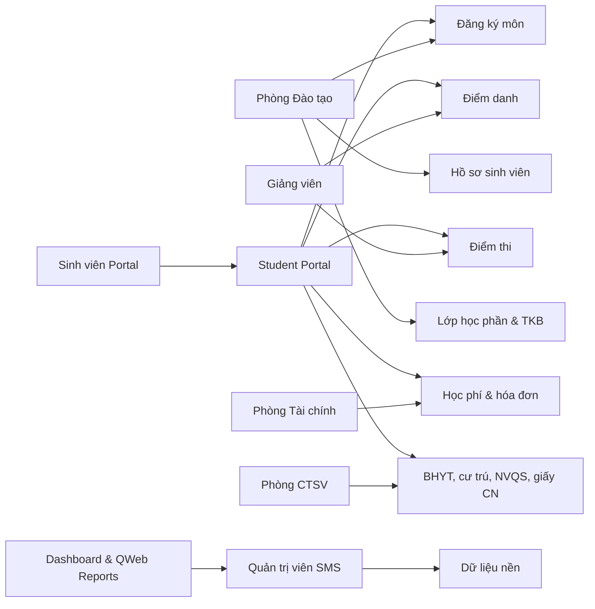

**Hình 1.1. Phạm vi tổng thể hệ thống University SMS**  
**Giải thích:** Sơ đồ cho thấy các nhóm người dùng chính và các phân hệ được triển khai.  
**Ý nghĩa:** Làm rõ hệ thống không chỉ quản lý hồ sơ sinh viên mà còn bao phủ quy trình đào tạo và dịch vụ sinh viên.  
**Vai trò:** Định hướng phạm vi phân tích trong các chương sau.  
**Luồng xử lý:** Người dùng backend cấu hình và xử lý nghiệp vụ; sinh viên sử dụng portal để tra cứu và gửi yêu cầu.

## 1.2 Lý do chọn đề tài

Trong môi trường đại học, dữ liệu sinh viên liên quan đến nhiều phòng ban khác nhau. Nếu mỗi bộ phận sử dụng một công cụ riêng lẻ, dữ liệu dễ bị trùng lặp, thiếu đồng bộ và khó kiểm soát quyền truy cập. Việc lựa chọn Odoo làm nền tảng triển khai giúp tận dụng các thành phần có sẵn như ORM, phân quyền, giao diện backend, portal, báo cáo QWeb, kế thừa model và cơ chế module hóa.

Các lý do chính để chọn đề tài:

- Nghiệp vụ quản lý sinh viên có tính thực tiễn cao.
- Odoo hỗ trợ phát triển nhanh các ứng dụng doanh nghiệp.
- PostgreSQL phù hợp với dữ liệu quan hệ phức tạp.
- Kiến trúc module giúp tách trách nhiệm rõ ràng.
- Portal của Odoo cho phép xây dựng kênh tự phục vụ cho sinh viên.
- Hệ thống có khả năng mở rộng sang e-learning, tích hợp thanh toán, chữ ký số hoặc API liên thông.

## 1.3 Mục tiêu

Mục tiêu của đồ án bao gồm:

- Xây dựng hệ thống quản lý sinh viên trên Odoo 17 Community.
- Thiết kế dữ liệu nền: khoa, bộ môn, ngành, môn học, năm học, học kỳ.
- Quản lý hồ sơ sinh viên và lớp hành chính.
- Quản lý lớp học phần, thời khóa biểu, điểm danh.
- Quản lý kỳ thi, kết quả thi, bảng điểm và GPA.
- Quản lý đăng ký môn học, môn tiên quyết, giới hạn tín chỉ và sĩ số.
- Quản lý học phí, hóa đơn học phí và liên kết kế toán.
- Xây dựng portal cho sinh viên tra cứu và thao tác nghiệp vụ cá nhân.
- Xây dựng các phân hệ công tác sinh viên: giấy chứng nhận, BHYT, cư trú, NVQS, rèn luyện, khảo sát, góp ý, thông báo.
- Xây dựng dashboard và báo cáo PDF.
- Phân quyền người dùng theo vai trò.

## 1.4 Phạm vi

Phạm vi đã triển khai trong source code gồm:

- Backend Odoo cho admin, phòng đào tạo, giảng viên, tài chính, công tác sinh viên, cố vấn học tập và trưởng khoa.
- Portal sinh viên với các route `/my/academic/*`.
- Docker Compose chạy Odoo 17 và PostgreSQL 15.
- Dữ liệu mẫu và script audit dữ liệu tiếng Việt.
- CSS theme backend trong `univ_sms_base/static/src/css/univ_sms_theme.css`.

Các nội dung **không áp dụng** theo source code hiện tại:

- Wizard: source code không có thư mục `wizard/` và không có model `TransientModel`.
- Scheduler/Cron: source code không có khai báo `ir.cron`.
- JavaScript custom: source code không có file `.js`.
- API REST riêng: source code không khai báo controller JSON/API ngoài các route portal.
- Calendar view: source code không khai báo calendar view.
- Import/Export tùy biến: hệ thống dùng cơ chế import/export chuẩn của Odoo, không có custom code.
- Payment gateway: không có tích hợp cổng thanh toán.
- Digital signature: không có ký số cho giấy chứng nhận.

## 1.5 Đối tượng

Đối tượng sử dụng hệ thống:

| Nhóm người dùng | Vai trò |
|---|---|
| Quản trị viên SMS | Quản lý toàn hệ thống, dữ liệu nền, phân quyền, kiểm soát dữ liệu |
| Phòng Đào tạo | Quản lý sinh viên, lớp, môn học, đăng ký môn, điểm |
| Giảng viên | Xem lớp phụ trách, điểm danh, nhập điểm |
| Phòng Tài chính | Quản lý học phí, hóa đơn |
| Phòng Công tác Sinh viên | Xử lý BHYT, cư trú, NVQS, giấy chứng nhận, khảo sát, góp ý |
| Cố vấn học tập | Theo dõi và duyệt điểm rèn luyện |
| Trưởng khoa | Duyệt điểm rèn luyện cấp khoa |
| Sinh viên | Sử dụng portal để đăng ký môn, xem điểm, xem học phí, gửi yêu cầu |

## 1.6 Phương pháp nghiên cứu

Phương pháp thực hiện bao gồm:

- Phân tích source code thực tế theo module.
- Đọc manifest để xác định dependency và dữ liệu nạp.
- Phân tích Python model để xác định field, relation, computed field, constraint và business method.
- Phân tích XML view để xác định form, tree, search, kanban, graph, pivot, menu, action và report.
- Phân tích security CSV và record rule để xác định RBAC.
- Phân tích controller portal để xác định route và luồng tương tác của sinh viên.
- Phân tích Docker Compose và `odoo.conf` để xác định môi trường triển khai.
- Đối chiếu với tài liệu nghiệp vụ trong thư mục `docs/`.

## 1.7 Kế hoạch thực hiện

**Bảng 1.1. Kế hoạch thực hiện đề tài**

| Giai đoạn | Nội dung | Kết quả |
|---|---|---|
| Giai đoạn 1 | Khảo sát nghiệp vụ và tài liệu | Xác định phạm vi hệ thống |
| Giai đoạn 2 | Thiết kế kiến trúc module | Chia module theo nghiệp vụ |
| Giai đoạn 3 | Xây dựng dữ liệu nền và sinh viên | `univ_sms_base`, `univ_sms_student` |
| Giai đoạn 4 | Xây dựng lớp, điểm danh, thi, học phí | `univ_sms_class`, `attendance`, `exam`, `fee` |
| Giai đoạn 5 | Xây dựng đăng ký môn và portal | `univ_sms_registration`, `univ_sms_portal` |
| Giai đoạn 6 | Xây dựng CTSV, rèn luyện, giấy CN, khảo sát | Các module mở rộng Phase 6-7 |
| Giai đoạn 7 | Xây dựng dashboard, report, seed data | `univ_sms_report`, script seed/audit |
| Giai đoạn 8 | Viết báo cáo và kiểm thử | Báo cáo kỹ thuật hoàn chỉnh |

## 1.8 Công nghệ sử dụng

**Bảng 1.2. Công nghệ sử dụng**

| Công nghệ | Phiên bản/ghi chú | Vai trò |
|---|---|---|
| Odoo | 17.0 Community | Nền tảng ERP |
| Python | 3.10+ theo tài liệu; môi trường local có thể khác | Viết model, controller, business logic |
| PostgreSQL | 15 | Cơ sở dữ liệu |
| Docker Compose | Theo `docker-compose.yml` | Đóng gói môi trường chạy |
| XML | Odoo XML data/view/security/report | Khai báo giao diện, menu, action, report |
| QWeb | Odoo report/template engine | Portal và PDF report |
| CSS | `univ_sms_theme.css` | Tùy chỉnh giao diện backend |
| Git | Không có `.git` trong thư mục hiện tại | Không áp dụng trong source đang bàn giao |

## 1.9 Kết luận chương

Chương 1 đã giới thiệu tổng quan đề tài, lý do chọn đề tài, mục tiêu, phạm vi, đối tượng sử dụng và công nghệ triển khai. Hệ thống University SMS là một ứng dụng ERP giáo dục được xây dựng theo kiến trúc module của Odoo, có phạm vi tương đối rộng, bao phủ nhiều nghiệp vụ quan trọng của trường đại học. Các chương tiếp theo sẽ trình bày nền tảng Odoo, hướng dẫn cài đặt và phân tích chi tiết source code.

\pagebreak

# CHƯƠNG 2. TỔNG QUAN VỀ FRAMEWORK ODOO

## 2.1 ERP

ERP là hệ thống hoạch định nguồn lực doanh nghiệp, cho phép tích hợp nhiều phân hệ nghiệp vụ vào một nền tảng thống nhất. Trong bối cảnh trường đại học, ERP có thể được hiểu là hệ thống tích hợp dữ liệu đào tạo, sinh viên, tài chính, nhân sự, cơ sở vật chất và báo cáo quản trị.

Một hệ thống ERP tốt cần đáp ứng:

- Dữ liệu tập trung.
- Phân quyền theo vai trò.
- Quy trình nghiệp vụ có trạng thái.
- Tự động hóa tác vụ lặp lại.
- Khả năng mở rộng.
- Báo cáo và phân tích dữ liệu.

### 2.1.1 Đặc điểm của hệ thống ERP

ERP không chỉ là một phần mềm đơn lẻ mà là một nền tảng tích hợp nhiều quy trình nghiệp vụ trong cùng một hệ thống. Dữ liệu được tổ chức tập trung, các phân hệ dùng chung nguồn dữ liệu và cùng tuân thủ cơ chế phân quyền thống nhất. Đối với môi trường giáo dục, đặc điểm này giúp giảm tình trạng mỗi phòng ban quản lý dữ liệu sinh viên bằng một tệp hoặc một ứng dụng riêng.

Trong đề tài University SMS, tư duy ERP được thể hiện qua việc dữ liệu sinh viên liên kết với lớp hành chính, lớp học phần, đăng ký môn, điểm danh, điểm thi, học phí, giấy chứng nhận, rèn luyện, khảo sát, góp ý và báo cáo. Mỗi phân hệ là một module riêng nhưng cùng vận hành trên nền tảng Odoo, dùng chung cơ sở dữ liệu PostgreSQL và cơ chế ORM.

### 2.1.2 Vai trò ERP trong quản lý sinh viên

ERP đóng vai trò là trục dữ liệu trung tâm cho toàn bộ vòng đời sinh viên. Khi hồ sơ sinh viên được tạo, các nghiệp vụ phát sinh sau đó như đăng ký học phần, điểm danh, nhập điểm, tính học phí hoặc cấp giấy chứng nhận đều có thể tham chiếu cùng một bản ghi sinh viên. Điều này giúp hệ thống bảo đảm tính nhất quán dữ liệu và giảm nhập liệu lặp lại.

Với đồ án này, ERP còn giúp minh họa cách một hệ thống quản lý sinh viên có thể mở rộng theo từng giai đoạn. Các module như `univ_sms_base`, `univ_sms_student`, `univ_sms_class`, `univ_sms_registration`, `univ_sms_fee`, `univ_sms_portal` và `univ_sms_report` có thể được cài đặt, kiểm thử và mở rộng độc lập nhưng vẫn hoạt động trong cùng một kiến trúc.

## 2.2 Odoo là gì

Odoo là nền tảng ERP mã nguồn mở, cung cấp nhiều ứng dụng chuẩn như Sales, Inventory, Accounting, CRM, HR, Website, Portal. Điểm mạnh của Odoo nằm ở kiến trúc module hóa và ORM mạnh, cho phép lập trình viên tạo các ứng dụng tùy biến mà không cần sửa core.

Trong hệ thống University SMS, toàn bộ tùy biến được đặt trong thư mục `addons/` với tiền tố `univ_sms_*`, đúng nguyên tắc không sửa core Odoo.

### 2.2.1 Odoo Community và Odoo Enterprise

Odoo có hai phiên bản phổ biến là Community và Enterprise. Odoo Community là phiên bản mã nguồn mở, phù hợp cho học tập, nghiên cứu và phát triển custom module. Odoo Enterprise bổ sung một số tính năng thương mại như giao diện nâng cao, ứng dụng mobile, studio, kế toán nâng cao và các dịch vụ hỗ trợ chính thức.

Source code của đề tài được xây dựng trên **Odoo 17 Community**. Việc lựa chọn phiên bản Community phù hợp với phạm vi đồ án vì toàn bộ chức năng quản lý sinh viên được triển khai bằng custom addon, không phụ thuộc vào tính năng Enterprise.

### 2.2.2 Lý do chọn Odoo cho đề tài

Odoo được chọn vì có kiến trúc module hóa rõ ràng, ORM mạnh, cơ chế phân quyền chuẩn, giao diện backend tự động sinh từ XML view, portal cho người dùng ngoài hệ thống và QWeb report cho in ấn. Những thành phần này phù hợp với yêu cầu xây dựng một hệ thống quản lý sinh viên có nhiều nghiệp vụ và nhiều nhóm người dùng.

Một lý do quan trọng khác là Odoo cho phép kế thừa và mở rộng module sẵn có mà không sửa trực tiếp core. Trong đề tài, hệ thống tận dụng `res.partner`, `mail.thread`, `mail.activity.mixin`, `portal`, `account` và QWeb report, đồng thời xây dựng mới các model nghiệp vụ riêng theo namespace `univ.sms.*`.

## 2.3 Kiến trúc Odoo

Odoo có kiến trúc nhiều lớp:

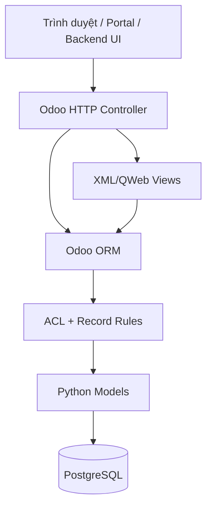

**Hình 2.1. Kiến trúc Odoo theo lớp**  
**Giải thích:** Người dùng tương tác qua backend hoặc portal; request đi qua controller/view, ORM, security rồi tới database.  
**Ý nghĩa:** Cho thấy phân quyền và ORM là lớp trung gian quan trọng.  
**Vai trò:** Là cơ sở để phân tích source code trong Chương 4.  
**Luồng xử lý:** Giao diện gọi action hoặc route, controller/model xử lý, ORM truy cập PostgreSQL.

## 2.4 ORM

ORM của Odoo ánh xạ class Python sang bảng PostgreSQL. Ví dụ model:

```python
class UnivSmsFaculty(models.Model):
    _name = 'univ.sms.faculty'
    _description = 'Khoa'

    name = fields.Char(string='Tên khoa', required=True, translate=True)
    code = fields.Char(string='Mã khoa', required=True)
```

Trong database, model `univ.sms.faculty` tương ứng bảng `univ_sms_faculty`. Field `name` và `code` trở thành cột dữ liệu. Odoo tự quản lý các cột hệ thống như `id`, `create_uid`, `create_date`, `write_uid`, `write_date`.

## 2.5 MVC

Odoo thường được mô tả theo mô hình gần với MVC:

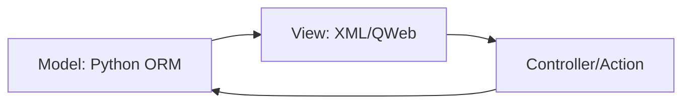

**Hình 2.2. Quan hệ MVC trong Odoo**  
**Giải thích:** Model lưu nghiệp vụ, View định nghĩa giao diện, Controller/Action điều phối tương tác.  
**Ý nghĩa:** Giúp phân tách trách nhiệm.  
**Vai trò:** Dự án University SMS tuân thủ cách tổ chức này.  
**Luồng xử lý:** Người dùng mở menu/action, view hiển thị dữ liệu từ model, method Python xử lý nghiệp vụ.

## 2.6 Module

Module Odoo là đơn vị đóng gói chức năng. Một module thường gồm:

- `__manifest__.py`: khai báo thông tin module.
- `__init__.py`: import Python package.
- `models/`: chứa model.
- `views/`: chứa XML views, actions, menu.
- `security/`: chứa access CSV và record rules.
- `data/`: chứa sequence, demo data hoặc dữ liệu cấu hình.
- `controllers/`: chứa HTTP route nếu có.
- `reports/`: chứa QWeb reports nếu có.

Source code hiện có 15 module custom, tất cả nằm trong `addons/`.

## 2.7 Manifest

Manifest là file bắt buộc của module. Ví dụ từ `univ_sms_registration`:

```python
{
    'name': 'University SMS - Registration',
    'version': '17.0.1.0.0',
    'category': 'Education',
    'summary': 'Đăng ký môn học (DKMH/DKMNV)',
    'depends': ['base', 'mail', 'univ_sms_base', 'univ_sms_student', 'univ_sms_class', 'univ_sms_exam'],
    'data': [
        'security/ir.model.access.csv',
        'security/security_rules.xml',
        'views/registration_period_views.xml',
        'views/course_offering_views.xml',
        'views/registration_views.xml',
        'views/elective_wish_views.xml',
        'views/menu_views.xml',
    ],
    'installable': True,
    'application': True,
}
```

Giải thích:

- `name`: tên hiển thị của module.
- `version`: phiên bản module.
- `category`: nhóm ứng dụng.
- `summary`: mô tả ngắn.
- `depends`: danh sách module phải cài trước.
- `data`: các file XML/CSV được nạp khi install/update.
- `installable`: module có thể cài đặt.
- `application`: hiển thị như một ứng dụng độc lập trong Apps.

## 2.8 XML

Odoo dùng XML để khai báo:

- View: form, tree/list, search, kanban, graph, pivot.
- Action: `ir.actions.act_window`.
- Menu: `menuitem`.
- Security rule: `ir.rule`.
- Report: `ir.actions.report`.
- Template: QWeb portal/report.

Trong source code, XML xuất hiện ở tất cả module nghiệp vụ. Module `univ_sms_report` dùng XML để khai báo graph, pivot và QWeb PDF.

## 2.9 Security

Security trong Odoo gồm hai lớp:

- Access Rights (`ir.model.access.csv`): xác định quyền CRUD trên model theo group.
- Record Rules (`ir.rule`): giới hạn bản ghi cụ thể được phép truy cập.

Dự án sử dụng RBAC theo các nhóm:

- `group_univ_admin`
- `group_univ_academic_officer`
- `group_univ_lecturer`
- `group_univ_finance_office`
- `group_univ_student_affairs_office`
- `group_univ_dean`
- `group_univ_advisor`
- `base.group_portal`

## 2.10 Access Rights

Access rights được khai báo bằng CSV. Ví dụ:

```csv
id,name,model_id:id,group_id:id,perm_read,perm_write,perm_create,perm_unlink
access_registration_portal,registration.portal,model_univ_sms_registration,base.group_portal,1,1,1,0
```

Dòng trên cho phép sinh viên portal đọc, tạo, sửa bản ghi đăng ký môn nhưng không được xóa. Hủy đăng ký được thực hiện bằng workflow đổi trạng thái sang `cancelled`, không xóa dữ liệu.

## 2.11 Record Rule

Record rule giới hạn theo từng bản ghi. Ví dụ:

```xml
<record id="rule_registration_portal_own" model="ir.rule">
    <field name="name">Portal: own registrations only</field>
    <field name="model_id" ref="model_univ_sms_registration"/>
    <field name="domain_force">[('student_id.partner_id', '=', user.partner_id.id)]</field>
    <field name="groups" eval="[(4, ref('base.group_portal'))]"/>
</record>
```

Rule này bảo đảm sinh viên portal chỉ nhìn thấy đăng ký môn của chính mình.

## 2.12 Menu

Menu được khai báo bằng `menuitem`. Ví dụ `univ_sms_base` tạo menu gốc:

```xml
<menuitem id="menu_univ_sms_root" name="🎓 Quản lý sinh viên"/>
```

Các module khác gắn menu con vào `univ_sms_base.menu_univ_sms_root`.

## 2.13 Action

Action mở một model với view mode cụ thể. Ví dụ:

```xml
<record id="action_univ_sms_student" model="ir.actions.act_window">
    <field name="name">Sinh viên</field>
    <field name="res_model">univ.sms.student</field>
    <field name="view_mode">tree,form</field>
</record>
```

Khi người dùng bấm menu "Danh sách sinh viên", action trên mở danh sách và form của model `univ.sms.student`.

## 2.14 View

Source code có các loại view:

- Tree/List view: danh sách bản ghi.
- Form view: nhập và xem chi tiết.
- Search view: bộ lọc và group by.
- Kanban view: có ở `univ.sms.faculty`.
- Graph view: dashboard.
- Pivot view: dashboard.
- QWeb template: portal và PDF report.

Calendar view: **Không áp dụng**, source code không khai báo calendar.

## 2.15 Workflow

Workflow trong source code được hiện thực bằng field `state` và các method `action_*`. Ví dụ:

- Sinh viên: `draft`, `studying`, `on_leave`, `graduated`, `dropped`, `dismissed`.
- Lớp học: `draft`, `open`, `closed`.
- Điểm danh: `draft`, `confirmed`.
- Kỳ thi: `draft`, `in_progress`, `done`.
- Đăng ký môn: `draft`, `registered`, `confirmed`, `cancelled`.
- Giấy chứng nhận: `draft`, `approved`, `completed`, `rejected`.
- Rèn luyện: `draft`, `submitted`, `advisor_approved`, `dean_approved`, `rejected`.

## 2.16 Database

Odoo tự tạo bảng dựa trên `_name`. Quy tắc chuyển đổi:

- `univ.sms.student` -> `univ_sms_student`
- `univ.sms.class` -> `univ_sms_class`
- `univ.sms.registration` -> `univ_sms_registration`

Quan hệ được khai báo bằng `Many2one`, `One2many`, `Many2many`.

## 2.17 PostgreSQL

PostgreSQL là hệ quản trị cơ sở dữ liệu được Odoo sử dụng. Trong dự án, Docker Compose khai báo service `db` dùng image `postgres:15`. Odoo kết nối đến host `db`, user `odoo`, password `odoo`.

## 2.18 Ưu nhược điểm

Ưu điểm của Odoo:

- Phát triển nhanh nhờ ORM và view XML.
- Có sẵn phân quyền, menu, action, report.
- Dễ mở rộng bằng module.
- Tích hợp được portal và accounting.

Nhược điểm:

- Cần hiểu kỹ cơ chế module, security và ORM.
- Khi dùng `sudo()` trong controller phải kiểm soát domain cẩn thận.
- Hiệu năng có thể bị ảnh hưởng nếu computed field dùng `search()` nhiều trên dữ liệu lớn.
- XML view dễ lỗi nếu sai external id hoặc thứ tự load file.

## 2.19 Kết luận chương

Chương 2 đã trình bày nền tảng lý thuyết về ERP và Odoo. Các khái niệm module, manifest, ORM, XML, security, access rights, record rule, menu, action và workflow là cơ sở quan trọng để phân tích source code của hệ thống University SMS trong Chương 4.

\pagebreak

# CHƯƠNG 3. THIẾT LẬP FRAMEWORK ODOO VÀ MÔI TRƯỜNG VẬN HÀNH HỆ THỐNG

## 3.1 Tổng quan mục tiêu thiết lập

Chương này trình bày quy trình thiết lập môi trường Odoo 17 Community để vận hành hệ thống University Student Management System. Trọng tâm của chương không phải là mô tả thao tác sao chép source code, mà là thiết lập một hệ thống Odoo hoàn chỉnh gồm Odoo framework, PostgreSQL, cấu hình runtime, cơ sở dữ liệu, custom addons, dữ liệu mẫu và các điểm truy cập sau khi cài đặt.

Trong Odoo, một ứng dụng nghiệp vụ không chạy độc lập như một chương trình Python thông thường. Ứng dụng được nạp vào Odoo thông qua cơ chế module, sử dụng ORM, registry, XML data, security, menu, action, view, controller và report của framework. Vì vậy, việc cài đặt hệ thống cần được hiểu là quá trình chuẩn bị môi trường Odoo, khởi tạo database, nạp custom module vào registry và kiểm tra toàn bộ hệ thống sau khi framework đã nhận diện module.

### 3.1.1 Kiến trúc môi trường triển khai

Source code hiện tại sử dụng Docker Compose để đóng gói môi trường chạy. Kiến trúc gồm hai service chính:

- Service `odoo` chạy image `odoo:17.0`, cung cấp Odoo framework, HTTP server, ORM, view engine, controller và QWeb report.
- Service `db` chạy image `postgres:15`, lưu database `univ_sms_db` và toàn bộ dữ liệu nghiệp vụ.

Thư mục `addons/` trên máy host được mount vào container Odoo tại `/mnt/extra-addons`. Nhờ đó, Odoo có thể nạp các custom addon `univ_sms_*` mà không cần chỉnh sửa image Odoo gốc.

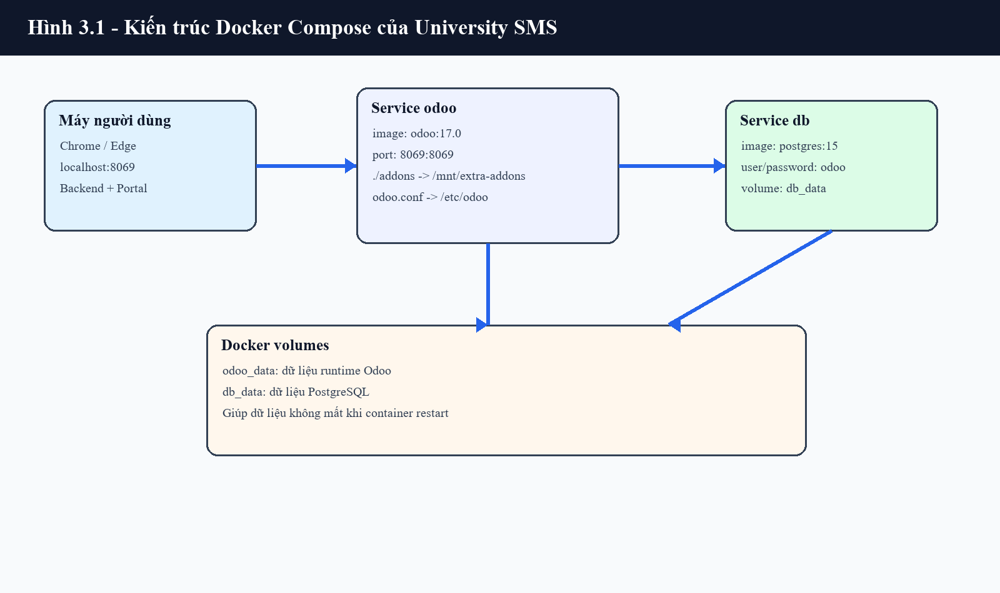

**Giải thích:** Hình 3.1 mô tả cách trình duyệt truy cập Odoo qua cổng `8069`, Odoo xử lý nghiệp vụ và kết nối PostgreSQL thông qua service `db`.  
**Ý nghĩa:** Kiến trúc này tách tầng ứng dụng và tầng dữ liệu, giúp hệ thống dễ khởi động, dừng, sao lưu và chuyển sang máy khác.  
**Vai trò:** Đây là nền tảng runtime cho toàn bộ module quản lý sinh viên.  
**Luồng xử lý:** Người dùng truy cập trình duyệt, request đi vào Odoo, Odoo dùng ORM đọc/ghi dữ liệu trong PostgreSQL.

### 3.1.2 Thành phần cần thiết của hệ thống

Một môi trường Odoo vận hành được hệ thống University SMS cần các thành phần sau:

| Thành phần | Vai trò | Cách triển khai trong dự án |
|---|---|---|
| Odoo Framework | Cung cấp ORM, view, menu, action, report, controller | Container `odoo:17.0` |
| PostgreSQL | Lưu dữ liệu nghiệp vụ và metadata Odoo | Container `postgres:15` |
| Custom Addons | Chứa module `univ_sms_*` | Mount `./addons:/mnt/extra-addons` |
| Cấu hình Odoo | Khai báo database, addons path, master password | File `odoo.conf` |
| Docker Compose | Điều phối Odoo và PostgreSQL | File `docker-compose.yml` |
| Trình duyệt | Truy cập backend và portal | `http://localhost:8069` |

## 3.2 Chuẩn bị môi trường trước khi khởi chạy Odoo

Trước khi khởi động Odoo, máy triển khai cần có Docker Desktop hoặc Docker Engine, Docker Compose plugin, trình duyệt web và dung lượng ổ đĩa đủ để lưu image cũng như database volume. Trên Windows, Docker Desktop cần được khởi động trước khi chạy các lệnh `docker compose`.

### 3.2.1 Yêu cầu phần cứng và phần mềm

Môi trường tối thiểu nên có CPU 2 nhân, RAM 4 GB, ổ cứng trống tối thiểu 5 GB và kết nối Internet trong lần chạy đầu tiên để tải image `odoo:17.0` và `postgres:15`. Với dữ liệu demo nhiều phân hệ, RAM 8 GB sẽ ổn định hơn.

Các phần mềm cần có:

- Docker Desktop hoặc Docker Engine.
- Docker Compose plugin.
- Chrome, Edge hoặc Firefox.
- VSCode hoặc trình soạn thảo tương đương để kiểm tra file cấu hình.
- Python local chỉ cần cho các script phụ trợ, không bắt buộc cho runtime Odoo vì Odoo chạy trong container.

Kiểm tra Docker:

```bash
docker --version
docker compose version
```

### 3.2.2 Cấu trúc thư mục triển khai

Thư mục triển khai cần giữ được các thành phần chính: `addons/`, `docker-compose.yml`, `odoo.conf` và tài liệu hướng dẫn. Các thư mục `__pycache__`, file tạm hoặc cookie không phải thành phần cốt lõi của hệ thống.

```text
Module_quan-ly-sinh-vien/
├── addons/
│   ├── univ_sms_base/
│   ├── univ_sms_student/
│   ├── univ_sms_registration/
│   ├── univ_sms_portal/
│   └── univ_sms_report/
├── docs/
├── docker-compose.yml
├── odoo.conf
└── HUONG_DAN_CAI_DAT.md
```

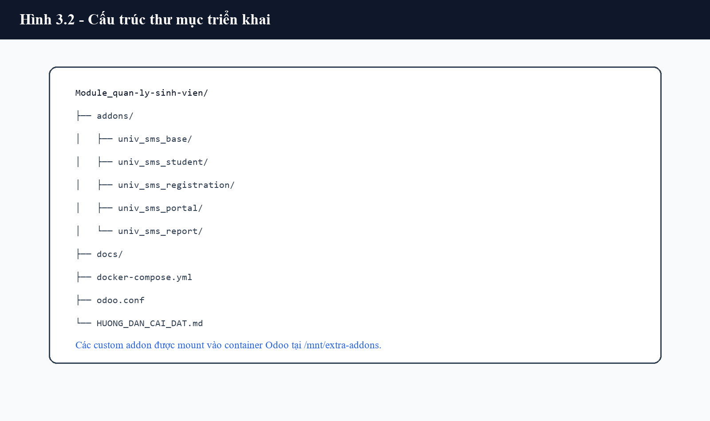

**Giải thích:** Hình 3.2 minh họa cấu trúc thư mục dùng để triển khai Odoo và custom addons.  
**Ý nghĩa:** Người triển khai cần đặt terminal tại thư mục chứa `docker-compose.yml` để các volume mount hoạt động đúng.  
**Vai trò:** Cấu trúc thư mục quyết định Odoo có đọc được custom addons hay không.  
**Luồng xử lý:** Docker Compose đọc `docker-compose.yml`, mount `./addons` vào container, Odoo đọc module từ `/mnt/extra-addons`.

## 3.3 Cấu hình Odoo framework bằng Docker Compose

Docker Compose là lớp điều phối môi trường. Thay vì cài thủ công Python, PostgreSQL, thư viện hệ thống và Odoo trên máy host, dự án dùng container để chuẩn hóa môi trường chạy. Cách làm này phù hợp với đồ án vì giảm lỗi khác biệt môi trường giữa các máy.

### 3.3.1 Cấu hình service PostgreSQL

Trong `docker-compose.yml`, service `db` sử dụng image `postgres:15`:

```yaml
db:
  image: postgres:15
  environment:
    POSTGRES_USER: odoo
    POSTGRES_PASSWORD: odoo
    POSTGRES_DB: postgres
  volumes:
    - db_data:/var/lib/postgresql/data
```

Service này tạo PostgreSQL server nội bộ cho Odoo. Volume `db_data` giúp dữ liệu database không bị mất khi container dừng hoặc restart. Odoo không kết nối PostgreSQL qua `localhost` mà kết nối qua hostname `db`, đúng theo tên service trong Docker Compose network.

### 3.3.2 Cấu hình service Odoo

Service `odoo` sử dụng image `odoo:17.0`, phụ thuộc service `db` và expose cổng `8069`:

```yaml
odoo:
  image: odoo:17.0
  depends_on:
    - db
  ports:
    - "8069:8069"
  volumes:
    - ./addons:/mnt/extra-addons
    - ./odoo.conf:/etc/odoo/odoo.conf
    - odoo_data:/var/lib/odoo
```

Cấu hình trên có ba điểm quan trọng. Thứ nhất, `8069:8069` cho phép truy cập Odoo từ trình duyệt tại `http://localhost:8069`. Thứ hai, `./addons:/mnt/extra-addons` đưa custom module vào Odoo framework. Thứ ba, `./odoo.conf:/etc/odoo/odoo.conf` bảo đảm Odoo chạy đúng cấu hình của hệ thống.

### 3.3.3 Cấu hình `odoo.conf`

File `odoo.conf` xác định cách Odoo kết nối database và nơi tìm addons:

```ini
[options]
addons_path = /mnt/extra-addons,/usr/lib/python3/dist-packages/odoo/addons
db_host = db
db_user = odoo
db_password = odoo
db_name = univ_sms_db
admin_passwd = <hashed master password>
```

`addons_path` gồm hai phần. `/mnt/extra-addons` là nơi chứa custom module của đồ án, còn `/usr/lib/python3/dist-packages/odoo/addons` là nơi chứa addons chuẩn đi kèm Odoo. `db_host = db` cho biết Odoo kết nối đến service PostgreSQL trong Docker Compose. `db_name = univ_sms_db` xác định database mặc định của hệ thống.

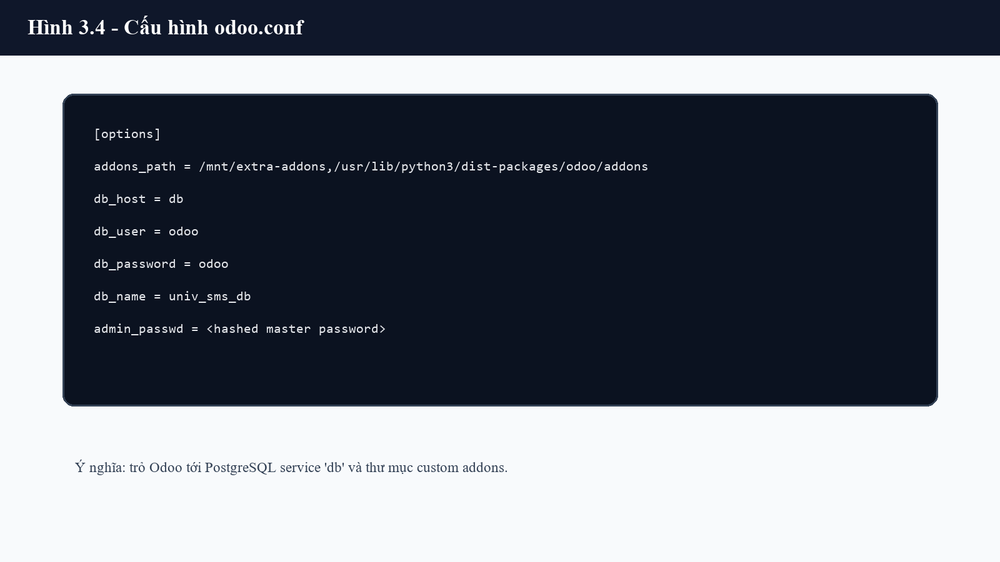

**Giải thích:** Hình 3.3 thể hiện các tham số quan trọng trong file cấu hình Odoo.  
**Ý nghĩa:** Nếu `addons_path` hoặc `db_host` sai, Odoo sẽ không nhận module hoặc không kết nối được database.  
**Vai trò:** Đây là điểm nối giữa Odoo framework, custom addons và PostgreSQL.  
**Luồng xử lý:** Khi container Odoo khởi động, Odoo đọc `odoo.conf`, kết nối database và scan addons path.

## 3.4 Khởi động Odoo framework và khởi tạo database

Sau khi chuẩn bị Docker Compose và `odoo.conf`, bước tiếp theo là khởi động các container. Đây là bước đưa Odoo framework và PostgreSQL vào trạng thái sẵn sàng để tạo database và cài module.

### 3.4.1 Khởi động container

Chạy lệnh sau tại thư mục chứa `docker-compose.yml`:

```bash
docker compose up -d
```

Lệnh này tải image nếu máy chưa có, tạo network, tạo volume và khởi động hai container `db`, `odoo`. Sau đó kiểm tra trạng thái bằng:

```bash
docker compose ps
```

Kết quả mong muốn là service `db` và `odoo` đều ở trạng thái `Up`, trong đó Odoo map cổng `8069`.

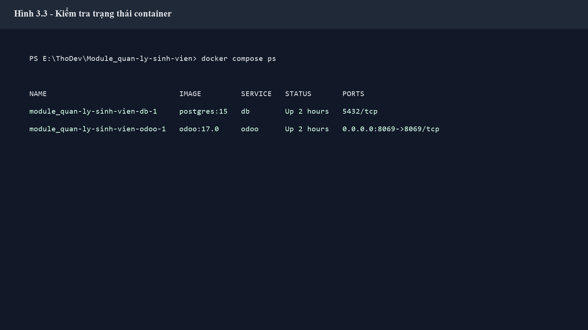

**Giải thích:** Hình 3.4 minh họa kết quả `docker compose ps` khi PostgreSQL và Odoo đã chạy.  
**Ý nghĩa:** Đây là bằng chứng môi trường framework đã hoạt động trước khi cài module.  
**Vai trò:** Giúp người triển khai xác định lỗi nằm ở container hay ở module.  
**Luồng xử lý:** Docker khởi động PostgreSQL trước, sau đó Odoo kết nối đến database thông qua service `db`.

### 3.4.2 Khởi tạo database Odoo

Database sử dụng trong dự án là `univ_sms_db`. Nếu database chưa tồn tại, người triển khai mở:

```text
http://localhost:8069
```

Sau đó tạo database mới với tên `univ_sms_db`. Tài khoản quản trị ban đầu có thể đặt là `admin/admin` trong môi trường demo. Khi database được tạo, Odoo sẽ tạo các bảng hệ thống như `ir_model`, `ir_ui_view`, `ir_module_module`, `res_users`, `res_partner` và các bảng metadata khác. Các bảng nghiệp vụ `univ_sms_*` chỉ xuất hiện sau khi custom module được cài đặt.

### 3.4.3 Kiểm tra log framework

Log Odoo giúp xác định framework có khởi động đúng không:

```bash
docker compose logs -f odoo
```

Log PostgreSQL:

```bash
docker compose logs -f db
```

Khi kiểm tra log, cần chú ý các lỗi như không kết nối được database, sai `addons_path`, lỗi XML view, lỗi external id hoặc lỗi Python khi Odoo nạp module.

## 3.5 Cài đặt module nghiệp vụ vào Odoo framework

Sau khi Odoo framework và database đã sẵn sàng, custom addon được cài vào database. Đây là bước Odoo đọc manifest, tạo model trong registry, tạo bảng PostgreSQL, nạp security, action, menu, view, report và dữ liệu cấu hình.

### 3.5.1 Cơ chế cài module trong Odoo

Khi cài một module, Odoo xử lý theo thứ tự chính:

1. Đọc file `__manifest__.py` để xác định tên module, dependencies và danh sách file data.
2. Kiểm tra dependency, ví dụ `univ_sms_student` phụ thuộc `univ_sms_base`.
3. Import Python model để cập nhật registry.
4. Tạo hoặc cập nhật bảng PostgreSQL tương ứng với model.
5. Nạp security groups, access rights và record rules.
6. Nạp XML view, action, menu, QWeb template và report.
7. Ghi trạng thái module vào bảng `ir_module_module`.

Vì hệ thống University SMS gồm nhiều module liên quan nhau, thứ tự dependency rất quan trọng. Module dữ liệu nền phải được cài trước module sinh viên; module sinh viên phải có trước lớp học, điểm danh, thi, học phí và đăng ký môn.

### 3.5.2 Lệnh cài toàn bộ module

Lệnh cài toàn bộ module trong database `univ_sms_db`:

```bash
docker compose exec -T odoo odoo -c /etc/odoo/odoo.conf -d univ_sms_db -i univ_sms_base,univ_sms_student,univ_sms_class,univ_sms_attendance,univ_sms_exam,univ_sms_fee,univ_sms_registration,univ_sms_notification,univ_sms_feedback,univ_sms_student_affairs,univ_sms_conduct,univ_sms_certificate,univ_sms_survey,univ_sms_portal,univ_sms_report --stop-after-init
```

Trong đó:

- `docker compose exec -T odoo`: chạy lệnh bên trong container Odoo.
- `odoo -c /etc/odoo/odoo.conf`: chạy Odoo với file cấu hình đã mount.
- `-d univ_sms_db`: chọn database cần cài module.
- `-i ...`: cài danh sách module.
- `--stop-after-init`: dừng tiến trình sau khi cài xong để tránh chạy song song nhiều Odoo process.

Khi cập nhật code module đã cài, dùng `-u` thay cho `-i`:

```bash
docker compose exec -T odoo odoo -c /etc/odoo/odoo.conf -d univ_sms_db -u univ_sms_base,univ_sms_student,univ_sms_class,univ_sms_attendance,univ_sms_exam,univ_sms_fee,univ_sms_registration,univ_sms_notification,univ_sms_feedback,univ_sms_student_affairs,univ_sms_conduct,univ_sms_certificate,univ_sms_survey,univ_sms_portal,univ_sms_report --stop-after-init
```

### 3.5.3 Seed dữ liệu mẫu và kiểm tra dữ liệu

Sau khi module được cài, hệ thống có thể seed dữ liệu mẫu realistic:

```bash
cmd /c 'docker compose exec -T odoo bash -lc "odoo shell -d univ_sms_db < /mnt/extra-addons/seed_university_realistic.py"'
```

Trên Windows, nên dùng `cmd` như lệnh trên để hạn chế lỗi encoding tiếng Việt khi pipe file vào container. Script seed tạo dữ liệu khoa, bộ môn, ngành, môn học, sinh viên, giảng viên, lớp, thời khóa biểu, điểm danh, điểm thi, học phí, đăng ký môn, giấy chứng nhận, rèn luyện, khảo sát, góp ý, thông báo và tài khoản theo role.

Sau khi seed, chạy audit:

```bash
cmd /c 'docker compose exec -T odoo bash -lc "odoo shell -d univ_sms_db < /mnt/extra-addons/audit_university_data.py"'
```

Kết quả mong muốn:

```text
[audit] OK: no broken text markers found
```

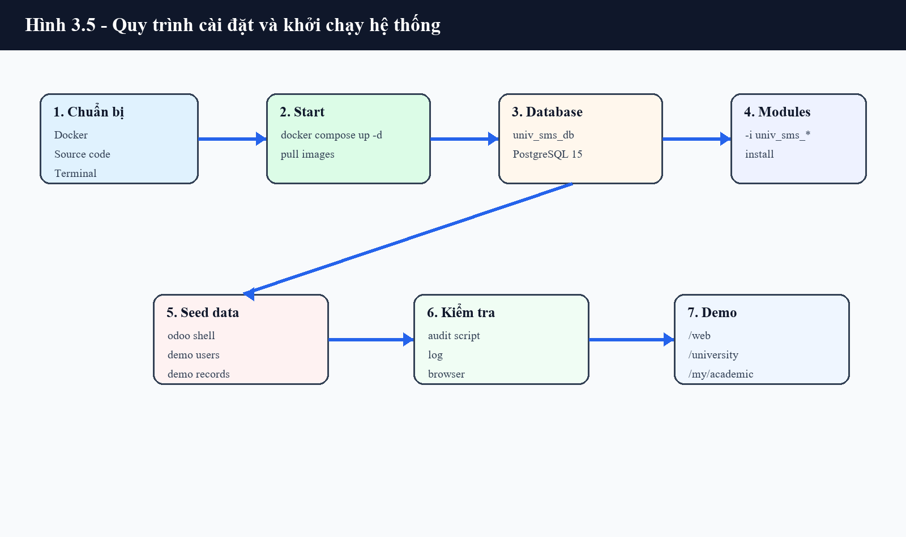

**Giải thích:** Hình 3.5 tóm tắt luồng từ chuẩn bị môi trường, khởi động Docker, tạo database, cài module, seed dữ liệu đến kiểm tra truy cập.  
**Ý nghĩa:** Giúp người đọc hình dung cài đặt Odoo là một chuỗi thao tác có thứ tự, không chỉ là chạy một lệnh.  
**Vai trò:** Là quy trình chuẩn để tái tạo môi trường demo.  
**Luồng xử lý:** Chuẩn bị Docker, chạy container, tạo database, cài module, seed data, audit và truy cập ứng dụng.

## 3.6 Kiểm tra hệ thống sau khi thiết lập

Sau khi Odoo framework đã chạy và module đã được cài, cần kiểm tra cả backend, portal, dashboard và dữ liệu demo. Bước này bảo đảm hệ thống không chỉ khởi động được mà còn vận hành đúng nghiệp vụ.

### 3.6.1 Kiểm tra các đường dẫn chính

Các URL chính sau khi cài đặt:

| Khu vực | URL | Mục đích kiểm tra |
|---|---|---|
| Backend Odoo | `http://localhost:8069/web` | Đăng nhập admin, kiểm tra menu backend |
| Landing page | `http://localhost:8069/university` | Kiểm tra route public và thông báo |
| Portal học vụ | `http://localhost:8069/my/academic` | Kiểm tra portal sinh viên |
| Form đăng ký sinh viên | `http://localhost:8069/student/register` | Kiểm tra route tự đăng ký |
| Portal đăng ký môn | `http://localhost:8069/my/academic/registration` | Kiểm tra nghiệp vụ đăng ký môn |
| Portal bảng điểm | `http://localhost:8069/my/academic/transcript` | Kiểm tra dữ liệu điểm |

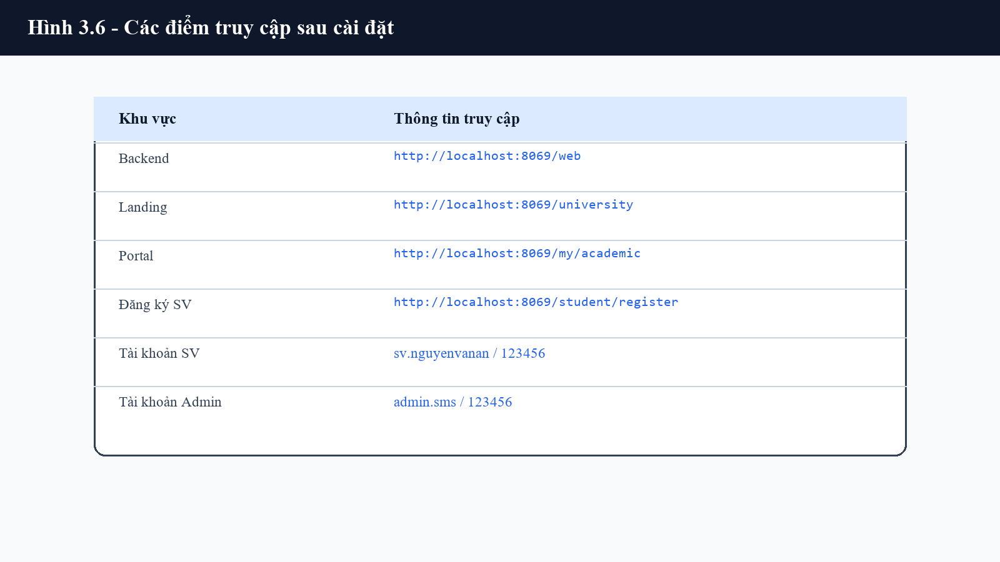

**Giải thích:** Hình 3.6 liệt kê các điểm truy cập quan trọng của hệ thống sau setup.  
**Ý nghĩa:** Đây là checklist nhanh để xác nhận Odoo framework, backend và portal đều hoạt động.  
**Vai trò:** Hỗ trợ người chấm hoặc người triển khai mở đúng màn hình demo.  
**Luồng xử lý:** Người dùng mở URL, Odoo xử lý route/action tương ứng và trả về backend hoặc portal view.

### 3.6.2 Tài khoản demo

Mật khẩu mặc định của các tài khoản seed là:

```text
123456
```

| Vai trò | Login | Mục đích kiểm tra |
|---|---|---|
| Admin SMS | `admin.sms` | Kiểm tra toàn bộ menu backend |
| Phòng Đào tạo | `dt.nguyenthilan` | Kiểm tra nghiệp vụ học vụ |
| Phòng Tài chính | `tc.phamquanghuy` | Kiểm tra học phí, hóa đơn |
| Phòng Công tác SV | `ctsv.levanhoa` | Kiểm tra BHYT, cư trú, giấy chứng nhận |
| Giảng viên | `gv.tranminhduc` | Kiểm tra lớp, điểm danh, điểm |
| Sinh viên | `sv.nguyenvanan` | Kiểm tra portal sinh viên |

### 3.6.3 Tiêu chí xác nhận cài đặt thành công

Hệ thống được xem là thiết lập thành công khi thỏa mãn các tiêu chí:

- `docker compose ps` hiển thị container `db` và `odoo` ở trạng thái `Up`.
- Truy cập được `http://localhost:8069/web`.
- Database `univ_sms_db` tồn tại.
- Các module `univ_sms_*` ở trạng thái installed.
- Backend hiển thị menu Quản lý sinh viên và các phân hệ liên quan.
- Portal `/my/academic` hiển thị thông tin sinh viên khi đăng nhập tài khoản sinh viên.
- Dữ liệu tiếng Việt không bị lỗi encoding.
- Các báo cáo QWeb có thể mở từ menu Print của bản ghi tương ứng.

## 3.7 Lỗi thường gặp và kết luận chương

Trong quá trình thiết lập Odoo framework, lỗi thường xuất hiện ở ba nhóm: lỗi môi trường Docker, lỗi kết nối database và lỗi nạp custom module. Việc kiểm tra log theo từng lớp giúp khoanh vùng nhanh nguyên nhân.

| Lỗi | Nguyên nhân thường gặp | Cách xử lý |
|---|---|---|
| Không vào được `localhost:8069` | Container Odoo chưa chạy hoặc port 8069 bị chiếm | Chạy `docker compose ps`, kiểm tra port, đổi mapping sang `8070:8069` nếu cần |
| Odoo không kết nối database | Sai `db_host`, service `db` chưa sẵn sàng | Kiểm tra `odoo.conf`, xem log `docker compose logs -f db` |
| Module không xuất hiện | Sai `addons_path` hoặc mount `./addons` lỗi | Kiểm tra volume mount và restart Odoo |
| Cài module lỗi XML | Sai external id, sai field trong view, thiếu dependency | Xem log Odoo, sửa XML, chạy lại `-u` |
| Lỗi quyền truy cập | Thiếu dòng trong `ir.model.access.csv` hoặc record rule sai | Kiểm tra security CSV và XML rule |
| Dữ liệu tiếng Việt bị lỗi | Pipe file seed qua PowerShell sai encoding | Chạy seed bằng lệnh `cmd /c` theo tài liệu |
| Portal không có dữ liệu sinh viên | User chưa gắn `partner_id` với `univ.sms.student` | Kiểm tra dữ liệu seed hoặc hồ sơ sinh viên |

Chương 3 đã trình bày quy trình thiết lập Odoo framework và môi trường vận hành cho hệ thống University SMS. Nội dung chương đi từ kiến trúc Docker Compose, chuẩn bị môi trường, cấu hình Odoo, khởi tạo database, cài custom module, seed dữ liệu đến kiểm tra sau cài đặt. Qua đó có thể thấy hệ thống không chỉ là một tập source code, mà là một ứng dụng Odoo hoàn chỉnh được nạp vào framework, vận hành trên Odoo 17 Community và PostgreSQL 15.


\pagebreak

# CHƯƠNG 4. XÂY DỰNG MODULE QUẢN LÝ SINH VIÊN TRÊN NỀN TẢNG ODOO

## 4.1 Tổng quan giải pháp xây dựng module

Chương này trình bày giải pháp xây dựng hệ thống University Student Management System dưới dạng các custom addon trên Odoo 17 Community. Trọng tâm của chương là cách hệ thống được thiết kế, cài vào framework Odoo, tổ chức cơ sở dữ liệu, xây dựng giao diện backend/portal, phân quyền, xử lý nghiệp vụ và kiểm thử bằng dữ liệu demo. Khác với một ứng dụng web viết độc lập, hệ thống này vận hành bên trong Odoo framework nên mọi thành phần như model, view, menu, action, security, controller và report đều tuân theo chuẩn mở rộng của Odoo.

Về nghiệp vụ, hệ thống tập trung vào quản lý sinh viên và các hoạt động liên quan trong trường đại học: dữ liệu nền đào tạo, hồ sơ sinh viên, lớp hành chính, lớp học phần, thời khóa biểu, điểm danh, kỳ thi, bảng điểm, học phí, đăng ký môn, giấy chứng nhận, công tác sinh viên, điểm rèn luyện, khảo sát, góp ý, thông báo, dashboard và báo cáo in ấn.

### 4.1.1 Mục tiêu xây dựng module

Mục tiêu của hệ thống là tạo một bộ module có thể cài đặt vào Odoo để phục vụ quản lý sinh viên theo hướng tập trung dữ liệu, phân quyền theo vai trò và hỗ trợ cả backend lẫn portal. Hệ thống cần đáp ứng các yêu cầu:

- Quản lý dữ liệu đào tạo gồm khoa, bộ môn, ngành, môn học, năm học và học kỳ.
- Quản lý hồ sơ sinh viên, lớp hành chính, lớp học phần và thời khóa biểu.
- Cho phép sinh viên đăng ký môn học qua portal.
- Hỗ trợ giảng viên điểm danh, nhập điểm và theo dõi lớp phụ trách.
- Hỗ trợ phòng tài chính quản lý học phí, hóa đơn.
- Hỗ trợ phòng công tác sinh viên xử lý BHYT, cư trú, NVQS, giấy chứng nhận, khảo sát và góp ý.
- Cung cấp dashboard, QWeb report và dữ liệu demo để trình bày hệ thống.

### 4.1.2 Phạm vi module và phân hệ

Source code hiện có 15 custom addon chính theo tiền tố `univ_sms_*`. Các module được chia theo nhóm nghiệp vụ thay vì gom toàn bộ vào một module lớn. Cách chia này giúp việc bảo trì, cài đặt và mở rộng rõ ràng hơn.

| Nhóm phân hệ | Module | Vai trò |
|---|---|---|
| Nền tảng dữ liệu | `univ_sms_base` | Khoa, bộ môn, ngành, môn học, năm học, học kỳ |
| Sinh viên | `univ_sms_student` | Hồ sơ sinh viên, lớp hành chính, enrollment |
| Lớp học | `univ_sms_class` | Lớp học phần, thời khóa biểu, mở rộng enrollment |
| Điểm danh | `univ_sms_attendance` | Phiếu điểm danh và dòng điểm danh |
| Thi và điểm | `univ_sms_exam` | Kỳ thi, kết quả thi, bảng điểm |
| Tài chính | `univ_sms_fee` | Học phí, hóa đơn học phí |
| Đăng ký môn | `univ_sms_registration` | Đợt đăng ký, lớp môn học, đăng ký môn, nguyện vọng |
| Portal | `univ_sms_portal` | Landing, portal học vụ, form đăng ký sinh viên |
| Báo cáo | `univ_sms_report` | QWeb report, dashboard graph/pivot |
| Mở rộng CTSV | `univ_sms_student_affairs`, `univ_sms_conduct`, `univ_sms_certificate`, `univ_sms_survey`, `univ_sms_feedback`, `univ_sms_notification` | Công tác sinh viên, rèn luyện, giấy chứng nhận, khảo sát, góp ý, thông báo |

### 4.1.3 Kiến trúc phụ thuộc custom addons

Các module có quan hệ phụ thuộc theo hướng từ dữ liệu nền đến nghiệp vụ mở rộng. Module `univ_sms_base` là nền tảng vì chứa các bảng dùng chung như khoa, bộ môn, ngành, môn học, năm học và học kỳ. Module `univ_sms_student` phụ thuộc dữ liệu nền để tạo hồ sơ sinh viên. Các module lớp học, điểm danh, thi, học phí và đăng ký môn phụ thuộc tiếp vào sinh viên và lớp.

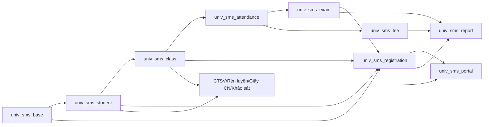

**Hình 4.1. Kiến trúc phụ thuộc custom addons**  
**Giải thích:** Sơ đồ thể hiện thứ tự phụ thuộc giữa các module trong hệ thống.  
**Ý nghĩa:** Khi cài đặt hoặc nâng cấp, module nền tảng phải được xử lý trước module nghiệp vụ.  
**Vai trò:** Giúp người phát triển hiểu vì sao manifest cần khai báo `depends` chính xác.  
**Luồng xử lý:** Odoo đọc manifest, cài dependency trước, sau đó mới nạp module phụ thuộc.

### 4.1.4 Chiến lược xây mới và kế thừa Odoo

Hệ thống được xây dựng theo hướng **xây mới nghiệp vụ quản lý sinh viên** nhưng **kế thừa hạ tầng chuẩn của Odoo**. Các model nghiệp vụ theo namespace `univ.sms.*` được tạo mới hoàn toàn để phục vụ bài toán đào tạo. Tuy nhiên hệ thống không viết lại các thành phần đã có sẵn trong Odoo như contact, chatter, portal, action, view, report, access rights hay kế toán.

| Thành phần | Xây mới | Kế thừa/mở rộng Odoo | Nhận xét |
|---|---|---|---|
| Hồ sơ sinh viên | Có | `_inherits = {'res.partner': 'partner_id'}` | Kế thừa dữ liệu liên hệ từ `res.partner` |
| Chatter/activity | Không | `_inherit = ['mail.thread', 'mail.activity.mixin']` | Dùng tracking/activity chuẩn |
| Partner | Không | `_inherit = 'res.partner'` | Bổ sung liên kết sinh viên |
| Enrollment | Có | `_inherit = 'univ.sms.enrollment'` trong module lớp | Mở rộng enrollment bằng lớp học phần |
| Môn học | Có | `_inherit = 'univ.sms.subject'` trong đăng ký môn | Bổ sung môn tiên quyết |
| Portal | Có giao diện riêng | Kế thừa `CustomerPortal` | Tận dụng cơ chế portal/user |
| Hóa đơn học phí | Có nghiệp vụ riêng | Liên kết `account.move` | Tận dụng kế toán Odoo |
| Report | Có template riêng | Dùng QWeb report chuẩn Odoo | Không viết engine in ấn riêng |

Như vậy, đề tài không sửa core Odoo. Toàn bộ tùy biến nằm trong `addons/`, phù hợp nguyên tắc triển khai ERP: mở rộng bằng addon, không can thiệp trực tiếp vào framework gốc.

## 4.2 Phân tích nghiệp vụ và luồng xử lý chính

Hệ thống phục vụ nhiều nhóm người dùng: quản trị viên SMS, phòng đào tạo, giảng viên, phòng tài chính, phòng công tác sinh viên, cố vấn học tập, trưởng khoa và sinh viên portal. Mỗi nhóm được cấp quyền khác nhau và thao tác trên các phân hệ tương ứng.

### 4.2.1 Quy trình nghiệp vụ tổng thể

Quy trình vận hành chính của hệ thống gồm các bước:

1. Quản trị viên hoặc phòng đào tạo tạo dữ liệu nền: khoa, bộ môn, ngành, môn học, năm học, học kỳ.
2. Phòng đào tạo tạo hồ sơ sinh viên, lớp hành chính, lớp học phần và thời khóa biểu.
3. Phòng đào tạo mở đợt đăng ký và tạo các lớp môn học.
4. Sinh viên đăng nhập portal để đăng ký môn.
5. Hệ thống kiểm tra điều kiện đăng ký: trạng thái sinh viên, thời gian, học kỳ, trùng môn, môn tiên quyết, tín chỉ và số chỗ.
6. Giảng viên điểm danh, nhập điểm và theo dõi lớp phụ trách.
7. Hệ thống tổng hợp bảng điểm, GPA và trạng thái đạt/không đạt.
8. Phòng tài chính tạo học phí và hóa đơn theo học kỳ.
9. Sinh viên xem điểm, điểm danh, học phí, thời khóa biểu và gửi yêu cầu hành chính.
10. Phòng ban xử lý giấy chứng nhận, NVQS, khảo sát, góp ý và điểm rèn luyện.
11. Admin hoặc phòng ban xem dashboard, in báo cáo.

### 4.2.2 Use Case tổng thể

```mermaid
flowchart TB
    Admin((Admin SMS))
    Academic((Phòng Đào tạo))
    Lecturer((Giảng viên))
    Finance((Phòng Tài chính))
    Affairs((Phòng CTSV))
    Advisor((Cố vấn HT))
    Dean((Trưởng khoa))
    Student((Sinh viên))

    UC1[Quản lý dữ liệu nền]
    UC2[Quản lý hồ sơ sinh viên]
    UC3[Quản lý lớp & TKB]
    UC4[Đăng ký môn]
    UC5[Điểm danh]
    UC6[Nhập điểm & bảng điểm]
    UC7[Học phí & hóa đơn]
    UC8[Giấy chứng nhận]
    UC9[BHYT, cư trú, NVQS]
    UC10[Rèn luyện]
    UC11[Khảo sát & góp ý]
    UC12[Thông báo]
    UC13[Dashboard & báo cáo]
    UC14[Portal học vụ]

    Admin --> UC1
    Admin --> UC13
    Academic --> UC1
    Academic --> UC2
    Academic --> UC3
    Academic --> UC4
    Academic --> UC6
    Lecturer --> UC5
    Lecturer --> UC6
    Finance --> UC7
    Affairs --> UC8
    Affairs --> UC9
    Affairs --> UC11
    Advisor --> UC10
    Dean --> UC10
    Student --> UC14
    Student --> UC4
    Student --> UC8
    Student --> UC9
    Student --> UC11
```

**Hình 4.2. Use Case tổng thể**  
**Giải thích:** Sơ đồ thể hiện actor và nhóm chức năng chính.  
**Ý nghĩa:** Xác định phạm vi triển khai của hệ thống trong đồ án.  
**Vai trò:** Là cơ sở ánh xạ actor sang group bảo mật và menu Odoo.  
**Luồng xử lý:** Người dùng đăng nhập, Odoo kiểm tra group, sau đó hiển thị menu/action tương ứng.

### 4.2.3 Luồng đăng ký môn trên portal

Đăng ký môn là nghiệp vụ tiêu biểu vì đi qua cả portal controller, model ORM, constraint và database. Sinh viên không thao tác trực tiếp trên backend mà dùng route portal `/my/academic/registration`.

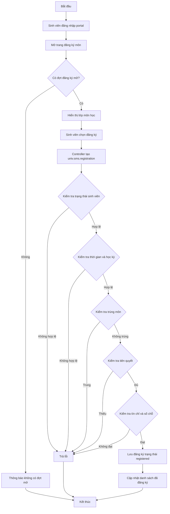

**Hình 4.3. Activity đăng ký môn học**  
**Giải thích:** Mô tả điều kiện kiểm tra trước khi tạo đăng ký môn.  
**Ý nghĩa:** Phản ánh trực tiếp các `@api.constrains` trong `registration.py`.  
**Vai trò:** Giúp kiểm thử luồng thành công và các nhánh lỗi.  
**Luồng xử lý:** Portal gọi controller, controller tạo model, model tự kiểm tra ràng buộc.

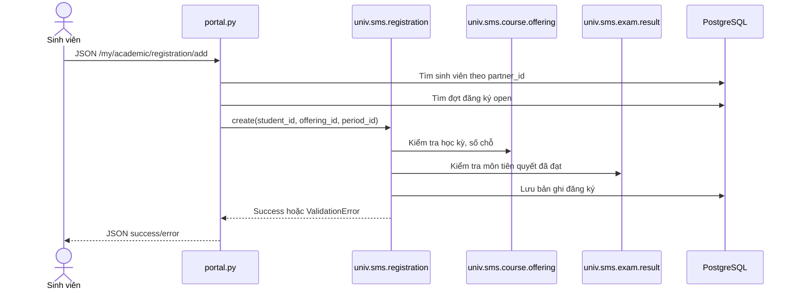

**Hình 4.4. Sequence đăng ký môn học trên portal**  
**Giải thích:** Mô tả tương tác giữa sinh viên, controller, model và database.  
**Ý nghĩa:** Cho thấy business logic nằm chủ yếu ở model, controller chỉ điều phối request.  
**Vai trò:** Hỗ trợ debug khi sinh viên không đăng ký được môn.  
**Luồng xử lý:** Request JSON được xử lý bởi route portal, sau đó ORM gọi constraint của model đăng ký.

## 4.3 Thiết kế cơ sở dữ liệu và model ORM

Thiết kế dữ liệu của hệ thống dựa trên ORM của Odoo. Mỗi class Python kế thừa `models.Model` tương ứng một model Odoo; nếu có `_name`, Odoo tạo bảng PostgreSQL tương ứng bằng cách thay dấu chấm bằng dấu gạch dưới. Ví dụ `univ.sms.student` tương ứng bảng `univ_sms_student`.

### 4.3.1 ERD tổng quát

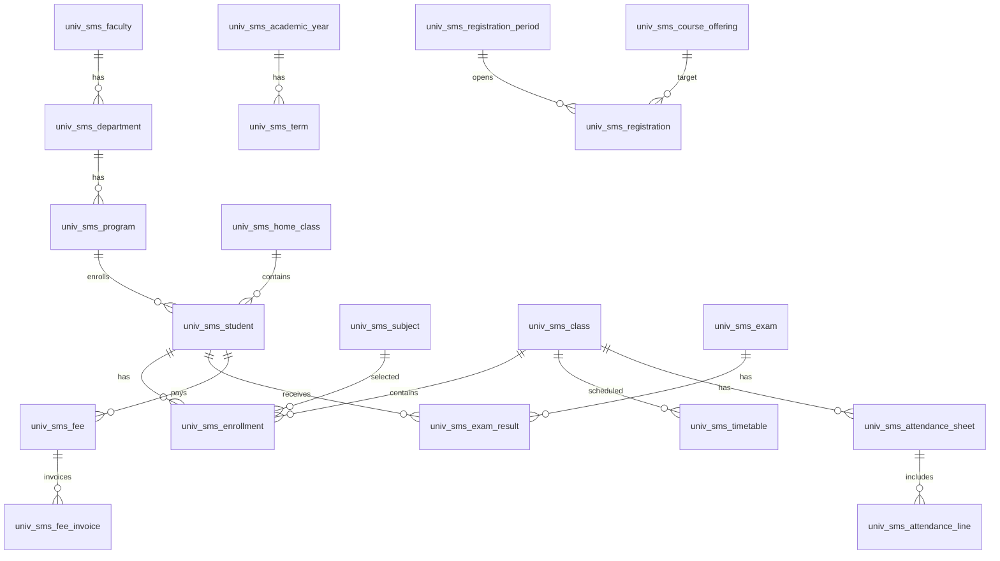

**Hình 4.5. ERD dữ liệu đào tạo và sinh viên**  
**Giải thích:** ERD biểu diễn các bảng và quan hệ chính trong PostgreSQL.  
**Ý nghĩa:** Cho thấy các khóa ngoại cốt lõi phát sinh từ field `Many2one`.  
**Vai trò:** Hỗ trợ thiết kế truy vấn, báo cáo và kiểm thử dữ liệu.  
**Luồng xử lý:** Dữ liệu nền liên kết xuống sinh viên, lớp, đăng ký, điểm và học phí.

### 4.3.2 Nhóm bảng dữ liệu chính

| Nhóm dữ liệu | Model tiêu biểu | Bảng PostgreSQL | Vai trò |
|---|---|---|---|
| Dữ liệu nền | `univ.sms.faculty`, `univ.sms.department`, `univ.sms.program`, `univ.sms.subject` | `univ_sms_faculty`, `univ_sms_department`, `univ_sms_program`, `univ_sms_subject` | Cấu trúc đào tạo |
| Thời gian học | `univ.sms.academic.year`, `univ.sms.term` | `univ_sms_academic_year`, `univ_sms_term` | Năm học, học kỳ |
| Sinh viên | `univ.sms.student`, `univ.sms.home.class`, `univ.sms.enrollment` | `univ_sms_student`, `univ_sms_home_class`, `univ_sms_enrollment` | Hồ sơ, lớp hành chính, đăng ký học |
| Lớp học | `univ.sms.class`, `univ.sms.timetable` | `univ_sms_class`, `univ_sms_timetable` | Lớp học phần, thời khóa biểu |
| Điểm danh | `univ.sms.attendance.sheet`, `univ.sms.attendance.line` | `univ_sms_attendance_sheet`, `univ_sms_attendance_line` | Buổi học, trạng thái chuyên cần |
| Thi và điểm | `univ.sms.exam`, `univ.sms.exam.result`, `univ.sms.transcript` | `univ_sms_exam`, `univ_sms_exam_result`, `univ_sms_transcript` | Kỳ thi, điểm, bảng điểm |
| Tài chính | `univ.sms.fee`, `univ.sms.fee.invoice` | `univ_sms_fee`, `univ_sms_fee_invoice` | Học phí và hóa đơn |
| Đăng ký môn | `univ.sms.registration.period`, `univ.sms.course.offering`, `univ.sms.registration` | `univ_sms_registration_period`, `univ_sms_course_offering`, `univ_sms_registration` | Đợt đăng ký, lớp mở, phiếu đăng ký |

Mỗi bảng Odoo đều có khóa chính `id` và các cột hệ thống như `create_uid`, `create_date`, `write_uid`, `write_date`. Các field `Many2one` tạo cột khóa ngoại dạng `<field>_id`. Các ràng buộc duy nhất được khai báo bằng `_sql_constraints`.

### 4.3.3 Model, field và quan hệ ORM

Các model được thiết kế theo đúng phong cách Odoo: dữ liệu nghiệp vụ đặt trong model, field mô tả dữ liệu và relation thể hiện quan hệ giữa bảng. Ví dụ model sinh viên có các nhóm field: mã sinh viên, thông tin cá nhân, liên hệ, gia đình, học vụ, trạng thái và quan hệ enrollment.

| Loại field | Ví dụ trong source | Ý nghĩa |
|---|---|---|
| `fields.Char` | `student_code`, `id_number`, `personal_email` | Chuỗi ký tự |
| `fields.Selection` | `state`, `gender`, `training_system` | Danh sách trạng thái/giá trị cố định |
| `fields.Many2one` | `program_id`, `home_class_id`, `term_id` | Khóa ngoại đến model khác |
| `fields.One2many` | `enrollment_ids`, `line_ids`, `invoice_ids` | Quan hệ ngược từ model con |
| `fields.Many2many` | `program_ids`, `prerequisite_ids` | Quan hệ nhiều-nhiều |
| `fields.Float` | `credit`, `score`, `total_amount` | Số thực |
| `fields.Monetary` | Dùng trong nghiệp vụ học phí/hóa đơn nếu cần tiền tệ | Giá trị tiền |

Một số quan hệ quan trọng:

- `univ.sms.department.faculty_id` liên kết bộ môn với khoa.
- `univ.sms.program.department_id` liên kết ngành với bộ môn.
- `univ.sms.student.program_id` liên kết sinh viên với ngành.
- `univ.sms.student.partner_id` liên kết sinh viên với `res.partner`.
- `univ.sms.enrollment.student_id` liên kết lịch sử học với sinh viên.
- `univ.sms.class` liên kết lớp học phần với môn, học kỳ, giảng viên.
- `univ.sms.registration.offering_id` liên kết phiếu đăng ký với lớp môn học mở.
- `univ.sms.exam.result.student_id` liên kết kết quả thi với sinh viên.
- `univ.sms.fee.student_id` liên kết học phí với sinh viên.

### 4.3.4 Constraint, computed field và onchange

Ràng buộc dữ liệu được đặt ở cả SQL constraint và Python constraint. SQL constraint đảm bảo tính duy nhất ở cấp database, còn `@api.constrains` xử lý điều kiện nghiệp vụ phức tạp.

| Model | Constraint | Ý nghĩa |
|---|---|---|
| `univ.sms.faculty` | `unique(code)` | Mã khoa duy nhất |
| `univ.sms.department` | `unique(code)` | Mã bộ môn duy nhất |
| `univ.sms.program` | `unique(code)` | Mã ngành duy nhất |
| `univ.sms.subject` | `unique(code)` | Mã môn duy nhất |
| `univ.sms.student` | `unique(student_code)` | MSSV duy nhất |
| `univ.sms.student` | `unique(id_number)` | CCCD/CMND duy nhất |
| `univ.sms.enrollment` | `unique(student_id, subject_id, term_id)` | Không trùng môn cùng kỳ |
| `univ.sms.registration` | `unique(student_id, offering_id)` | Không đăng ký trùng lớp môn học |
| `univ.sms.exam.result` | `unique(exam_id, student_id)` | Một kết quả cho mỗi kỳ thi/sinh viên |

Computed field chính gồm `school_email`, `student_count`, `enrollment_count`, `absence_rate`, `is_passed`, `term_gpa`, `cumulative_gpa`, `total_credits`, `total_amount`, `paid_amount`, `remaining_amount`, `available_seats`, `self_total`, `advisor_total`, `final_total`. Các field này giúp giảm thao tác nhập liệu và tự động tổng hợp dữ liệu theo nghiệp vụ.

`@api.onchange('period_id')` trong `univ.sms.registration` được dùng để xóa `offering_id` khi đổi đợt đăng ký. Mục đích là tránh trường hợp người dùng chọn lớp môn học thuộc học kỳ cũ sau khi đã thay đổi kỳ đăng ký.

## 4.4 Bảo mật, phân quyền và kiểm soát dữ liệu

Hệ thống sử dụng security chuẩn của Odoo gồm nhóm người dùng, access rights và record rules. Thiết kế này giúp phân tách người dùng backend theo phòng ban và giới hạn dữ liệu portal theo sinh viên hiện tại.

### 4.4.1 Nhóm người dùng nghiệp vụ

Các group nghiệp vụ được khai báo trong `univ_sms_base/security/security_groups.xml` và `security_groups_v2.xml`. Nhóm `group_univ_admin` có quyền cao nhất, kế thừa nhóm phòng đào tạo; phòng đào tạo kế thừa nhóm giảng viên trong file group cơ bản.

```xml
<record id="group_univ_lecturer" model="res.groups">
    <field name="name">Giảng viên</field>
    <field name="category_id" ref="module_category_university"/>
</record>

<record id="group_univ_academic_officer" model="res.groups">
    <field name="name">Cán bộ Phòng đào tạo</field>
    <field name="category_id" ref="module_category_university"/>
    <field name="implied_ids" eval="[(4, ref('group_univ_lecturer'))]"/>
</record>
```

| Group | Vai trò |
|---|---|
| `group_univ_admin` | Quản trị toàn hệ thống SMS |
| `group_univ_academic_officer` | Phòng đào tạo |
| `group_univ_lecturer` | Giảng viên |
| `group_univ_finance_office` | Phòng tài chính |
| `group_univ_student_affairs_office` | Phòng công tác sinh viên |
| `group_univ_advisor` | Cố vấn học tập |
| `group_univ_dean` | Trưởng khoa |
| `base.group_portal` | Sinh viên portal |

### 4.4.2 Access rights và record rules

Access rights được khai báo trong `security/ir.model.access.csv` của từng module. Ví dụ module đăng ký môn cấp quyền khác nhau cho admin, phòng đào tạo, giảng viên và portal:

```csv
access_registration_admin,registration.admin,model_univ_sms_registration,univ_sms_base.group_univ_admin,1,1,1,1
access_registration_officer,registration.officer,model_univ_sms_registration,univ_sms_base.group_univ_academic_officer,1,1,1,0
access_registration_portal,registration.portal,model_univ_sms_registration,base.group_portal,1,1,1,0
```

Record rules giới hạn dữ liệu theo người dùng. Nhóm portal chỉ được xem dữ liệu có `student_id.partner_id = user.partner_id`. Cách làm này đặc biệt quan trọng vì sinh viên không được xem điểm, học phí, điểm danh hoặc giấy chứng nhận của sinh viên khác.

| Nghiệp vụ | Record rule chính | Mục đích |
|---|---|---|
| Enrollment | `student_id.partner_id = user.partner_id` | Sinh viên xem học phần của mình |
| Attendance | `student_id.partner_id = user.partner_id` | Sinh viên xem chuyên cần của mình |
| Fee/Invoice | `student_id.partner_id = user.partner_id` | Sinh viên xem công nợ của mình |
| Registration | `student_id.partner_id = user.partner_id` | Sinh viên quản lý đăng ký của mình |
| Certificate | `student_id.partner_id = user.partner_id` | Sinh viên xem yêu cầu giấy của mình |
| Conduct | `student_id.partner_id = user.partner_id` | Sinh viên xem điểm rèn luyện của mình |

### 4.4.3 Nhận xét bảo mật

Thiết kế security hiện phù hợp với phạm vi đồ án. Tuy nhiên controller portal có dùng `sudo()` ở một số route để đảm bảo demo hoạt động ổn định, sau đó tự lọc theo `student_id`. Khi triển khai production, nên giảm `sudo()` hoặc bổ sung kiểm tra domain nghiêm ngặt hơn để hạn chế rủi ro truy cập vượt quyền.

## 4.5 Giao diện, menu, action, portal và hình ảnh minh họa

Giao diện của hệ thống được xây dựng chủ yếu bằng XML view của Odoo. Backend dùng tree, form, search, kanban, graph và pivot view. Portal dùng QWeb template và controller HTTP/JSON. Không có JavaScript custom trong source code hiện tại.

### 4.5.1 Backend view, action và menu

Mỗi phân hệ backend thường gồm view XML, action `ir.actions.act_window` và menuitem. Ví dụ màn hình sinh viên khai báo action:

```xml
<record id="action_univ_sms_student" model="ir.actions.act_window">
    <field name="name">Sinh viên</field>
    <field name="res_model">univ.sms.student</field>
    <field name="view_mode">tree,form</field>
    <field name="search_view_id" ref="view_univ_sms_student_search"/>
    <field name="context">{'search_default_studying': 1}</field>
</record>
```

Tree view phục vụ tra cứu nhanh, form view phục vụ nhập liệu và xử lý workflow, search view phục vụ lọc/nhóm dữ liệu. Kanban được dùng ở một số dữ liệu nền như Khoa. Graph/pivot được dùng ở dashboard.

### 4.5.2 Portal sinh viên

Portal nằm trong module `univ_sms_portal`, controller kế thừa `CustomerPortal`. Các route chính gồm landing `/university`, form đăng ký sinh viên `/student/register`, dashboard học vụ `/my/academic`, các trang transcript, attendance, fees, registration, timetable, certificates, affairs, conduct, surveys và feedback.

```python
class UnivSmsPortal(CustomerPortal):

    @route(['/my/academic'], type='http', auth='user', website=True)
    def portal_academic_home(self, **kw):
        student = self._get_student()
        return request.render('univ_sms_portal.portal_academic_home', {
            'student': student,
            'page_name': 'academic_home',
        })
```

Portal giúp sinh viên tự phục vụ các nghiệp vụ cá nhân thay vì phải truy cập backend. Đây là điểm khác biệt quan trọng giữa người dùng nội bộ và sinh viên.

### 4.5.3 API nội bộ và các thành phần không áp dụng

Source code không có REST API riêng. Route JSON chính là:

```python
@route(['/my/academic/registration/add'], type='json', auth='user', website=True)
def portal_registration_add(self, offering_id=None, **kw):
```

Route này nhận `offering_id`, tìm sinh viên hiện tại, tìm đợt đăng ký mở và tạo bản ghi `univ.sms.registration`. Ngoài route JSON phục vụ portal, hệ thống không có API public độc lập.

Các thành phần không áp dụng theo source code:

| Thành phần | Kết luận | Căn cứ |
|---|---|---|
| Wizard | Không áp dụng | Không có thư mục `wizard/`, không có `models.TransientModel` |
| Calendar view | Không áp dụng | Không có XML calendar view |
| Cron/Scheduler | Không áp dụng | Không có khai báo `ir.cron` |
| JavaScript custom | Không áp dụng | Không có file `.js` |
| REST API riêng | Không áp dụng | Chỉ có route HTTP/JSON cho portal |

### 4.5.4 Danh mục hình ảnh giao diện minh họa

Các screenshot đã được chụp trực tiếp từ Odoo đang chạy tại `http://localhost:8069` và lưu trong thư mục `docs/screenshots/`. Bộ hình bao phủ login, landing, portal, menu backend, list view, form view, dashboard, report, import và export.

> Các screenshot đã được chụp trực tiếp từ Odoo đang chạy tại `http://localhost:8069` và lưu trong thư mục `docs/screenshots/`. Cột "File ảnh" ghi tên file tương ứng để chèn vào bản Word hoặc tài liệu xuất bản.

| Hình | Màn hình | File ảnh | Giải thích | Ý nghĩa | Vai trò | Luồng xử lý |
|---|---|---|---|---|---|---|
| Hình 4.6 | Login Odoo | `screenshots/hinh-4-6-login.png` | Màn hình đăng nhập chuẩn Odoo | Xác thực người dùng | Cổng vào backend/portal | User nhập login/password |
| Hình 4.7 | Landing `/university` | `screenshots/hinh-4-7-landing.png` | Trang công khai của trường | Điều hướng người dùng | Giới thiệu và hiển thị thông báo | Public user mở landing |
| Hình 4.8 | Portal học vụ | `screenshots/hinh-4-8-portal-home.png` | Trang chính `/my/academic` | Tổng quan sinh viên | Hub chức năng portal | Sinh viên đăng nhập và chọn chức năng |
| Hình 4.9 | Form đăng ký sinh viên | `screenshots/hinh-4-9-student-register.png` | Public route `/student/register` | Tạo tài khoản/hồ sơ | Tự đăng ký sinh viên | Nhập form, submit tạo user portal |
| Hình 4.10 | Menu Quản lý sinh viên | `screenshots/hinh-4-10-main-menu.png` | Menu root backend | Tập trung phân hệ | Điều hướng admin | User backend mở app |
| Hình 4.11 | Khoa - Kanban | `screenshots/hinh-4-11-faculty-kanban.png` | Kanban khoa | Xem nhanh cơ cấu | Dữ liệu nền | Mở menu Khoa |
| Hình 4.12 | Khoa - Form | `screenshots/hinh-4-12-faculty-form.png` | Form khoa | Nhập mã/tên/trưởng khoa | Quản lý khoa | Tạo/sửa khoa |
| Hình 4.13 | Bộ môn - List/Form | `screenshots/hinh-4-13-department.png` | Bộ môn | Quản lý cấp dưới khoa | Dữ liệu nền | Chọn khoa, nhập bộ môn |
| Hình 4.14 | Ngành đào tạo | `screenshots/hinh-4-14-program.png` | Ngành | Quản lý chương trình | Liên kết sinh viên/môn | Nhập mã ngành, tín chỉ |
| Hình 4.15 | Môn học | `screenshots/hinh-4-15-subject.png` | Môn học | Tín chỉ, ngành, tiên quyết | Nền tảng đăng ký/điểm | Tạo môn và prerequisite |
| Hình 4.16 | Năm học | `screenshots/hinh-4-16-academic-year.png` | Năm học | Quản lý thời gian đào tạo | Liên kết học kỳ | Nhập ngày bắt đầu/kết thúc |
| Hình 4.17 | Học kỳ | `screenshots/hinh-4-17-term.png` | Học kỳ | Gắn với lớp, điểm, phí | Đơn vị vận hành học vụ | Tạo học kỳ thuộc năm học |
| Hình 4.18 | Danh sách sinh viên | `screenshots/hinh-4-18-student-list.png` | Tree sinh viên | Tra cứu hồ sơ | Quản lý dữ liệu SV | Lọc theo ngành/lớp/trạng thái |
| Hình 4.19 | Form sinh viên | `screenshots/hinh-4-19-student-form.png` | Form nhiều tab | Hồ sơ cá nhân/học vụ | Trung tâm dữ liệu SV | Tạo, xác nhận, bảo lưu, tốt nghiệp |
| Hình 4.20 | Tra cứu sinh viên | `screenshots/hinh-4-20-student-lookup.png` | View lookup | Xem nhanh thông tin | Phục vụ người dùng chỉ đọc | Tìm MSSV/tên |
| Hình 4.21 | Lớp hành chính | `screenshots/hinh-4-21-home-class.png` | Lớp hành chính | Gán sinh viên/CVHT | Quản lý khóa/lớp | Tạo lớp theo ngành/năm |
| Hình 4.22 | Enrollment | `screenshots/hinh-4-22-enrollment.png` | Đăng ký học gốc | Lịch sử học phần | Nguồn cho điểm danh/fee | Tạo enrollment theo kỳ |
| Hình 4.23 | Lớp học phần | `screenshots/hinh-4-23-class.png` | Lớp học | Môn, giảng viên, học kỳ | Vận hành đào tạo | Mở/đóng lớp |
| Hình 4.24 | Thời khóa biểu | `screenshots/hinh-4-24-timetable.png` | TKB | Ngày, giờ, phòng | Sinh viên tra cứu lịch | Tạo slot theo lớp |
| Hình 4.25 | Phiếu điểm danh | `screenshots/hinh-4-25-attendance-sheet.png` | Phiếu điểm danh | Ghi nhận buổi học | Theo dõi chuyên cần | Tải SV, cập nhật trạng thái, xác nhận |
| Hình 4.26 | Kỳ thi | `screenshots/hinh-4-26-exam.png` | Kỳ thi | Tạo bài kiểm tra | Nhập điểm | Tải SV, chấm, hoàn thành |
| Hình 4.27 | Kết quả thi | `screenshots/hinh-4-27-exam-result.png` | Điểm từng sinh viên | Xác định đạt/không đạt | Phục vụ tiên quyết/GPA | Nhập score |
| Hình 4.28 | Bảng điểm | `screenshots/hinh-4-28-transcript.png` | GPA học kỳ/tích lũy | Tổng hợp học tập | Xét cảnh báo/tốt nghiệp | Generate từ enrollment, sync điểm |
| Hình 4.29 | Khoản học phí | `screenshots/hinh-4-29-fee.png` | Học phí kỳ | Tính theo tín chỉ | Quản lý công nợ | Tạo phí, tính tổng |
| Hình 4.30 | Hóa đơn học phí | `screenshots/hinh-4-30-fee-invoice.png` | Invoice nội bộ | Thu học phí | Liên kết account.move | Xác nhận, thanh toán |
| Hình 4.31 | Đợt đăng ký | `screenshots/hinh-4-31-registration-period.png` | Đợt DKMH | Mở/đóng thời gian | Kiểm soát đăng ký | Tạo đợt, set open |
| Hình 4.32 | Lớp môn học | `screenshots/hinh-4-32-course-offering.png` | Offering | Sĩ số, số chỗ, tiên quyết | Đối tượng sinh viên đăng ký | Tạo offering theo học kỳ |
| Hình 4.33 | Đăng ký môn backend | `screenshots/hinh-4-33-registration.png` | Danh sách đăng ký | PĐT theo dõi/chốt | Quản lý DKMH | Xác nhận/hủy đăng ký |
| Hình 4.34 | Nguyện vọng | `screenshots/hinh-4-34-elective-wish.png` | DKMNV | Môn tự chọn | Thu thập nhu cầu | Sinh viên/PĐT tạo nguyện vọng |
| Hình 4.35 | Thông báo | `screenshots/hinh-4-35-notification.png` | Thông báo | Toàn trường/ngành/lớp | Truyền thông | Soạn, publish, archive |
| Hình 4.36 | Góp ý backend | `screenshots/hinh-4-36-feedback-backend.png` | Xử lý góp ý | Tiếp nhận phản hồi | Dịch vụ sinh viên | Chuyển trạng thái xử lý |
| Hình 4.37 | BHYT | `screenshots/hinh-4-37-health-insurance.png` | Bảo hiểm | Mã thẻ, hạn dùng | CTSV quản lý | Xác nhận BHYT |
| Hình 4.38 | Cư trú/ngoại trú | `screenshots/hinh-4-38-residence.png` | Địa chỉ cư trú | Quản lý ngoại trú | CTSV | Xác nhận thông tin |
| Hình 4.39 | NVQS | `screenshots/hinh-4-39-military.png` | Nghĩa vụ quân sự | Trạng thái khai báo | CTSV | Submit, approve, reject |
| Hình 4.40 | Tiêu chí rèn luyện | `screenshots/hinh-4-40-conduct-criteria.png` | Tiêu chí | Thang điểm | Cấu hình rèn luyện | Tạo nhóm tiêu chí |
| Hình 4.41 | Điểm rèn luyện | `screenshots/hinh-4-41-conduct-score.png` | Phiếu rèn luyện | Workflow 3 cấp | Đánh giá SV | SV gửi, CVHT duyệt, Khoa duyệt |
| Hình 4.42 | Loại giấy chứng nhận | `screenshots/hinh-4-42-certificate-type.png` | Loại giấy | Cấu hình phí | CTSV | Tạo loại giấy |
| Hình 4.43 | Yêu cầu giấy CN | `screenshots/hinh-4-43-certificate-request.png` | Request cấp giấy | Theo dõi trạng thái | Dịch vụ hành chính | Duyệt, hoàn thành, từ chối |
| Hình 4.44 | Loại khảo sát | `screenshots/hinh-4-44-survey-type.png` | Survey type | Phân loại khảo sát | CTSV | Tạo loại |
| Hình 4.45 | Đợt khảo sát | `screenshots/hinh-4-45-survey-instance.png` | Survey instance | Mở/đóng khảo sát | Thu thập phản hồi | Open/close |
| Hình 4.46 | Phản hồi khảo sát | `screenshots/hinh-4-46-survey-response.png` | Response | Nội dung sinh viên | Phân tích ý kiến | Sinh viên submit |
| Hình 4.47 | Portal đăng ký môn | `screenshots/hinh-4-47-portal-registration.png` | DKMH portal | Sinh viên tự đăng ký | Tự phục vụ | Click đăng ký/hủy |
| Hình 4.48 | Portal thời khóa biểu | `screenshots/hinh-4-48-portal-timetable.png` | TKB portal | Xem lịch học | Tự phục vụ | Lọc lớp đã đăng ký |
| Hình 4.49 | Portal bảng điểm | `screenshots/hinh-4-49-portal-transcript.png` | Điểm portal | Xem kết quả thi | Minh bạch học tập | Query exam result |
| Hình 4.50 | Portal điểm danh | `screenshots/hinh-4-50-portal-attendance.png` | Điểm danh portal | Xem chuyên cần | Tự theo dõi | Query attendance line |
| Hình 4.51 | Portal học phí | `screenshots/hinh-4-51-portal-fees.png` | Học phí portal | Xem công nợ | Minh bạch tài chính | Query fee |
| Hình 4.52 | Portal giấy chứng nhận | `screenshots/hinh-4-52-portal-certificates.png` | Gửi yêu cầu giấy | Tự phục vụ hành chính | CTSV xử lý backend | Create certificate.request |
| Hình 4.53 | Portal công tác SV | `screenshots/hinh-4-53-portal-affairs.png` | BHYT, cư trú, NVQS | Quản lý cá nhân | Sinh viên gửi NVQS | Create military.service |
| Hình 4.54 | Portal rèn luyện | `screenshots/hinh-4-54-portal-conduct.png` | Xem điểm rèn luyện | Theo dõi đánh giá | Minh bạch kết quả | Query conduct.score |
| Hình 4.55 | Portal khảo sát | `screenshots/hinh-4-55-portal-surveys.png` | Trả lời khảo sát | Thu thập ý kiến | CTSV tổng hợp | Submit survey.response |
| Hình 4.56 | Portal góp ý | `screenshots/hinh-4-56-portal-feedback.png` | Gửi góp ý | Kênh phản hồi | Phòng ban xử lý | Create feedback |
| Hình 4.57 | Dashboard sinh viên | `screenshots/hinh-4-57-dashboard-student.png` | Graph/Pivot SV | Thống kê sinh viên | Quản trị | Mở dashboard |
| Hình 4.58 | Dashboard điểm danh | `screenshots/hinh-4-58-dashboard-attendance.png` | Graph/Pivot điểm danh | Theo dõi chuyên cần | Quản trị đào tạo | Xem theo lớp/kỳ |
| Hình 4.59 | Dashboard điểm thi | `screenshots/hinh-4-59-dashboard-exam.png` | Graph/Pivot điểm | Phân tích kết quả | Quản trị đào tạo | Xem điểm theo môn/lớp |
| Hình 4.60 | Dashboard học phí | `screenshots/hinh-4-60-dashboard-fee.png` | Graph/Pivot invoice | Công nợ/thu học phí | Tài chính | Xem theo trạng thái |
| Hình 4.61 | Dashboard đăng ký môn | `screenshots/hinh-4-61-dashboard-registration.png` | Graph/Pivot đăng ký | Theo dõi DKMH | PĐT | Xem theo môn/kỳ |
| Hình 4.62 | Dashboard rèn luyện | `screenshots/hinh-4-62-dashboard-conduct.png` | Graph/Pivot rèn luyện | Phân tích xếp loại | CTSV/Khoa | Xem final_total |
| Hình 4.63 | Print bảng điểm | `screenshots/hinh-4-63-report-transcript.png` | QWeb PDF | In bảng điểm | Báo cáo học tập | Print từ transcript |
| Hình 4.64 | Print hóa đơn | `screenshots/hinh-4-64-report-invoice.png` | QWeb PDF | In hóa đơn | Tài chính | Print từ invoice |
| Hình 4.65 | Print điểm rèn luyện | `screenshots/hinh-4-65-report-conduct.png` | QWeb PDF | In phiếu rèn luyện | CTSV | Print từ conduct score |
| Hình 4.66 | Print giấy chứng nhận | `screenshots/hinh-4-66-report-certificate.png` | QWeb PDF | In giấy CN | Hành chính SV | Print từ certificate request |
| Hình 4.67 | Print phiếu đăng ký môn | `screenshots/hinh-4-67-report-registration.png` | QWeb PDF | In DKMH | PĐT/SV | Print từ registration |
| Hình 4.68 | Print phiếu điểm danh | `screenshots/hinh-4-68-report-attendance.png` | QWeb PDF | In attendance sheet | Giảng viên/PĐT | Print từ sheet |
| Hình 4.69 | Import chuẩn Odoo | `screenshots/hinh-4-69-import.png` | Import mặc định | Nhập dữ liệu hàng loạt | Không custom | Dùng chức năng chuẩn Odoo |
| Hình 4.70 | Export chuẩn Odoo | `screenshots/hinh-4-70-export.png` | Export mặc định | Xuất dữ liệu | Không custom | Dùng chức năng chuẩn Odoo |

\pagebreak

## 4.6 Business logic, giải thuật và source code tiêu biểu

Business logic của hệ thống được đặt chủ yếu trong Python model. Đây là cách thiết kế đúng trong Odoo vì controller hoặc button chỉ kích hoạt thao tác, còn model chịu trách nhiệm kiểm tra nghiệp vụ, cập nhật trạng thái và bảo toàn dữ liệu.

### 4.6.1 Manifest và cấu trúc khai báo module

Manifest là điểm vào của mỗi module. Ví dụ module `univ_sms_registration`:

```python
{
    'name': 'University SMS - Registration',
    'version': '17.0.1.0.0',
    'category': 'Education',
    'depends': ['base', 'mail', 'univ_sms_base', 'univ_sms_student', 'univ_sms_class', 'univ_sms_exam'],
    'data': [
        'security/ir.model.access.csv',
        'security/security_rules.xml',
        'views/registration_period_views.xml',
        'views/course_offering_views.xml',
        'views/registration_views.xml',
        'views/elective_wish_views.xml',
        'views/menu_views.xml',
    ],
    'installable': True,
    'application': True,
}
```

Manifest cho Odoo biết module phụ thuộc những module nào và cần nạp file nào khi cài đặt. Nếu thiếu dependency hoặc thiếu file data, module có thể lỗi khi cài.

### 4.6.2 Kế thừa `res.partner` và sinh mã sinh viên

Model sinh viên là ví dụ rõ nhất về kết hợp xây mới và kế thừa:

```python
class UnivSmsStudent(models.Model):
    _name = 'univ.sms.student'
    _description = 'Sinh viên'
    _inherits = {'res.partner': 'partner_id'}
    _inherit = ['mail.thread', 'mail.activity.mixin']
    _order = 'student_code'
```

`_inherits` cho phép `univ.sms.student` dùng lại dữ liệu liên hệ của `res.partner`. Trong khi đó `_inherit = ['mail.thread', 'mail.activity.mixin']` giúp hồ sơ sinh viên có chatter và activity.

Mã sinh viên được sinh tự động bằng sequence:

```xml
<record id="seq_student_code" model="ir.sequence">
    <field name="name">Mã số sinh viên</field>
    <field name="code">univ.sms.student</field>
    <field name="padding">4</field>
    <field name="number_next">1</field>
    <field name="number_increment">1</field>
</record>
```

Python `create()` ghép năm, mã ngành và số thứ tự:

```python
@api.model_create_multi
def create(self, vals_list):
    for vals in vals_list:
        if vals.get('student_code', 'New') == 'New':
            seq_num = self.env['ir.sequence'].next_by_code('univ.sms.student') or '0000'
            year = str(fields.Date.today().year)[2:]
            program = self.env['univ.sms.program'].browse(vals.get('program_id'))
            prog_code = (program.code or 'SV')[:5].upper() if program else 'SV'
            vals['student_code'] = f"{year}{prog_code}{seq_num}"
    return super().create(vals_list)
```

Giải thuật: khi tạo hồ sơ, nếu `student_code` còn là `New`, hệ thống lấy sequence, lấy hai số cuối của năm hiện tại, lấy mã ngành và ghép thành MSSV. Sau khi tạo, hàm `write()` không cho sửa MSSV để bảo toàn định danh.

### 4.6.3 Giải thuật đăng ký môn

Đăng ký môn có nhiều constraint để bảo đảm dữ liệu hợp lệ. Các điều kiện gồm sinh viên phải đang học, đợt đăng ký phải mở, lớp môn học đúng học kỳ, không trùng môn, đủ tiên quyết, không vượt tín chỉ và còn chỗ.

```python
@api.constrains('period_id', 'offering_id', 'state')
def _check_period_and_offering(self):
    now = fields.Datetime.now()
    for rec in self:
        if rec.state == 'cancelled' or not rec.period_id or not rec.offering_id:
            continue
        if rec.period_id.state != 'open':
            raise ValidationError(_('Đợt đăng ký chưa mở hoặc đã đóng.'))
        if rec.period_id.date_start and now < rec.period_id.date_start:
            raise ValidationError(_('Đợt đăng ký chưa tới thời gian bắt đầu.'))
        if rec.period_id.date_end and now > rec.period_id.date_end:
            raise ValidationError(_('Đợt đăng ký đã hết hạn.'))
        if rec.offering_id.term_id != rec.period_id.term_id:
            raise ValidationError(_('Lớp môn học phải thuộc đúng học kỳ của đợt đăng ký.'))
```

Kiểm tra môn tiên quyết:

```python
@api.constrains('offering_id', 'student_id')
def _check_prerequisite(self):
    for rec in self:
        prereqs = rec.offering_id.subject_id.prerequisite_ids
        if prereqs:
            passed = self.env['univ.sms.exam.result'].search([
                ('student_id', '=', rec.student_id.id),
                ('subject_id', 'in', prereqs.ids),
                ('is_passed', '=', True),
            ]).mapped('subject_id')
            missing = prereqs - passed
            if missing:
                raise ValidationError(
                    _('Chưa hoàn thành môn tiên quyết: %s') %
                    ', '.join(missing.mapped('name')))
```

Nhận xét: logic đăng ký môn được đặt ở model nên dù bản ghi được tạo từ backend hay portal, các ràng buộc vẫn được áp dụng nhất quán.

### 4.6.4 Giải thuật điểm danh, điểm và học phí

Điểm danh dùng button method để tải sinh viên từ enrollment vào phiếu:

```python
def action_load_students(self):
    self.ensure_one()
    if self.state == 'confirmed':
        raise ValidationError('Không thể sửa phiếu đã xác nhận!')
    enrollments = self.env['univ.sms.enrollment'].search([
        ('class_id', '=', self.class_id.id),
        ('state', '=', 'registered'),
    ])
```

Học phí được tính từ tổng số tín chỉ đã đăng ký trong học kỳ:

```python
@api.depends('student_id', 'term_id')
def _compute_total_credits(self):
    Enrollment = self.env['univ.sms.enrollment']
    for record in self:
        if record.student_id and record.term_id:
            enrollments = Enrollment.search([
                ('student_id', '=', record.student_id.id),
                ('term_id', '=', record.term_id.id),
                ('state', '=', 'registered'),
            ])
            record.total_credits = sum(enr.subject_id.credit for enr in enrollments)
        else:
            record.total_credits = 0
```

Sau đó tổng tiền học phí được tính:

```python
record.total_amount = record.fee_per_credit * record.total_credits
```

Điểm và GPA được tính trong module `univ_sms_exam`. Kết quả thi xác định `is_passed`; bảng điểm tổng hợp điểm học kỳ và tích lũy. Đây là nhóm logic có thể tiếp tục tối ưu khi dữ liệu lớn bằng stored computed field hoặc batch computation.

## 4.7 Báo cáo, dashboard, dữ liệu demo, kiểm thử và hiệu năng

Hệ thống không chỉ có CRUD dữ liệu mà còn có báo cáo PDF, dashboard graph/pivot và dữ liệu demo để trình bày nghiệp vụ hoàn chỉnh.

### 4.7.1 QWeb report và dashboard

Module `univ_sms_report` khai báo các report QWeb:

| File | Report | Model |
|---|---|---|
| `reports/transcript_report.xml` | Bảng điểm | `univ.sms.transcript` |
| `reports/invoice_report.xml` | Hóa đơn học phí | `univ.sms.fee.invoice` |
| `reports/conduct_score_report.xml` | Phiếu điểm rèn luyện | `univ.sms.conduct.score` |
| `reports/certificate_report.xml` | Giấy chứng nhận | `univ.sms.certificate.request` |
| `reports/registration_slip_report.xml` | Phiếu đăng ký môn | `univ.sms.registration` |
| `reports/attendance_sheet_report.xml` | Phiếu điểm danh | `univ.sms.attendance.sheet` |

Dashboard sử dụng graph/pivot/list view:

| Dashboard | Model | View mode |
|---|---|---|
| Dashboard Sinh viên | `univ.sms.student` | `graph,pivot,list` |
| Dashboard Điểm danh | `univ.sms.attendance.sheet` | `graph,pivot,list` |
| Dashboard Điểm thi | `univ.sms.exam.result` | `graph,pivot,list` |
| Dashboard Học phí | `univ.sms.fee.invoice` | `graph,pivot,list` |
| Dashboard Đăng ký môn | `univ.sms.registration` | `graph,pivot,list` |
| Dashboard Rèn luyện | `univ.sms.conduct.score` | `graph,pivot,list` |

### 4.7.2 Dữ liệu demo và tài khoản kiểm thử

Source có các script:

- `addons/seed_university_realistic.py`
- `addons/audit_university_data.py`
- `addons/audit_samples.sql`
- `addons/create_mock_data.py`
- `addons/create_mock_data_v2.py`
- `addons/create_mock_data_v3.py`

Script chính là `seed_university_realistic.py`, tạo dữ liệu realistic gồm khoa, bộ môn, ngành, môn, sinh viên, giảng viên, lớp, thời khóa biểu, điểm danh, điểm thi, học phí, đăng ký môn, giấy chứng nhận, rèn luyện, khảo sát, góp ý, thông báo và tài khoản theo role. Tài khoản demo tiêu biểu gồm `admin.sms`, `dt.nguyenthilan`, `tc.phamquanghuy`, `ctsv.levanhoa`, `gv.tranminhduc`, `sv.nguyenvanan`.

### 4.7.3 Kịch bản kiểm thử nghiệp vụ

| Kịch bản | Dữ liệu vào | Kết quả mong muốn |
|---|---|---|
| Sinh viên đăng ký môn hợp lệ | Sinh viên đang học, đợt mở, còn chỗ | Tạo `univ.sms.registration` trạng thái `registered` |
| Đăng ký khi đợt đóng | `period_id.state != open` | Báo lỗi validation |
| Đăng ký trùng môn trong kỳ | Cùng sinh viên, cùng subject, cùng term | Báo lỗi trùng môn |
| Thiếu môn tiên quyết | Chưa có `exam.result.is_passed` cho prerequisite | Báo lỗi chưa hoàn thành tiên quyết |
| Vượt tín chỉ tối đa | Tổng tín chỉ vượt `period.max_credit` | Báo lỗi vượt tín chỉ |
| Portal xem dữ liệu cá nhân | User portal có `partner_id` gắn sinh viên | Chỉ thấy dữ liệu của sinh viên đó |
| In bảng điểm | Có transcript và transcript line | Mở QWeb report bảng điểm |
| Tính học phí | Có enrollment trong kỳ | `total_amount = fee_per_credit * total_credits` |

### 4.7.4 Nhận xét hiệu năng

Với dữ liệu demo, các computed field và dashboard hiện hoạt động phù hợp. Khi dữ liệu lớn, một số điểm cần tối ưu:

- Một số computed field dùng `search()` trong vòng lặp, ví dụ attendance stats, GPA tích lũy, học phí.
- Portal dùng `sudo().search()` có domain theo sinh viên, nên cần bảo đảm các field như `student_id` được index tốt khi dữ liệu lớn.
- Dashboard graph/pivot dựa trên model gốc; khi dữ liệu tăng mạnh có thể cân nhắc model báo cáo riêng hoặc materialized view.
- Các tác vụ batch như tạo học phí hàng loạt, chốt đăng ký, import điểm nên phát triển thêm wizard hoặc cron trong giai đoạn sau.

## 4.8 Link demo, đánh giá hoàn thiện và kết luận chương

### 4.8.1 Link demo ứng dụng

Hệ thống đang chạy bằng Docker/Odoo local. Các link demo chính:

| Mục demo | URL | Ghi chú |
|---|---|---|
| Backend Odoo | `http://localhost:8069/web` | Đăng nhập quản trị để mở các menu backend |
| Landing page | `http://localhost:8069/university` | Trang công khai giới thiệu và điều hướng |
| Portal học vụ sinh viên | `http://localhost:8069/my/academic` | Sinh viên đăng nhập để xem thông tin cá nhân |
| Form đăng ký sinh viên | `http://localhost:8069/student/register` | Public route để tạo tài khoản/hồ sơ sinh viên |
| Portal đăng ký môn | `http://localhost:8069/my/academic/registration` | Sinh viên đăng ký/hủy môn học |
| Dashboard báo cáo | `http://localhost:8069/web` | Vào menu Dashboards trong backend |

### 4.8.2 Kịch bản demo gợi ý

Khi trình bày trước hội đồng, có thể demo theo thứ tự:

1. Đăng nhập backend bằng `admin.sms`.
2. Mở menu Quản lý sinh viên, xem danh sách sinh viên và form sinh viên.
3. Mở dữ liệu nền: khoa, ngành, môn học, học kỳ.
4. Mở lớp học phần và thời khóa biểu.
5. Đăng nhập portal bằng `sv.nguyenvanan`.
6. Vào `/my/academic/registration`, đăng ký hoặc xem môn đã đăng ký.
7. Xem bảng điểm, điểm danh, học phí trên portal.
8. Quay lại backend, mở dashboard và in QWeb report.

### 4.8.3 Kết luận chương

Chương 4 đã trình bày quá trình xây dựng module quản lý sinh viên trên Odoo theo hướng custom addon. Hệ thống được xây mới về nghiệp vụ nhưng kế thừa hạ tầng chuẩn của Odoo như `res.partner`, `mail.thread`, `CustomerPortal`, QWeb report, action, menu, view, access rights và record rules. Về dữ liệu, hệ thống tổ chức model theo namespace `univ.sms.*`, có quan hệ rõ ràng giữa dữ liệu nền, sinh viên, lớp học, điểm danh, điểm thi, học phí và đăng ký môn. Về giao diện, hệ thống có cả backend và portal, kèm dashboard và báo cáo in ấn.

Các logic quan trọng như sinh mã sinh viên, kiểm tra đăng ký môn, kiểm tra môn tiên quyết, tính học phí và tải danh sách điểm danh được đặt ở tầng model, phù hợp nguyên tắc phát triển Odoo. Bên cạnh các chức năng đã hoàn thiện, một số thành phần như wizard, cron, REST API riêng và JavaScript custom chưa được triển khai trong source hiện tại, nên được ghi nhận là không áp dụng hoặc hướng phát triển tiếp theo.


\pagebreak

# CHƯƠNG 5. ĐÁNH GIÁ HỆ THỐNG VÀ HƯỚNG PHÁT TRIỂN

## 5.1 Ưu điểm

- Kiến trúc module rõ ràng, dễ bảo trì.
- Dữ liệu nền được tách riêng trong `univ_sms_base`.
- Hồ sơ sinh viên kế thừa `res.partner`, phù hợp kiến trúc Odoo.
- Có portal sinh viên đầy đủ chức năng tự phục vụ.
- Có phân quyền theo role nghiệp vụ.
- Có record rule giới hạn dữ liệu portal theo sinh viên.
- Có dashboard và QWeb PDF report.
- Có Docker Compose giúp triển khai dễ dàng.
- Có script seed dữ liệu realistic và audit encoding.
- Business logic quan trọng được đặt trong model bằng constraint và computed field.

## 5.2 Nhược điểm

- Chưa có test tự động.
- Chưa có wizard cho thao tác hàng loạt.
- Chưa có cron tự động đóng đợt đăng ký hoặc khảo sát.
- Portal controller dùng `sudo()` nhiều, cần rà soát khi triển khai production.
- Chưa có API tích hợp hệ thống ngoài.
- Chưa có JavaScript custom cho trải nghiệm portal nâng cao.
- Chưa có payment gateway cho học phí.
- Chưa có ký số giấy chứng nhận.

## 5.3 Hạn chế

Một số nghiệp vụ mới dừng ở mức cơ bản:

- Khảo sát là model riêng đơn giản, chưa tích hợp module `survey` chuẩn của Odoo.
- Rèn luyện có workflow nhưng chưa kiểm tra điểm tối đa từng tiêu chí.
- Học phí tạo hóa đơn kế toán ở mức cơ bản, chưa cấu hình đầy đủ account, tax, product.
- Thông báo có đối tượng nhận nhưng portal landing hiện mới lấy thông báo published, chưa lọc sâu theo ngành/lớp sinh viên.
- Dữ liệu import/export dùng chuẩn Odoo, chưa có template nghiệp vụ riêng.

## 5.4 Khả năng mở rộng

Hệ thống có khả năng mở rộng tốt nhờ:

- Tách module theo nghiệp vụ.
- Dùng `_inherit` để mở rộng model có sẵn.
- Dùng state machine đơn giản.
- Dùng QWeb cho report.
- Dùng portal route có thể thêm chức năng mới.

Các hướng mở rộng khả thi:

- Tích hợp thanh toán học phí.
- Tích hợp ký số giấy chứng nhận.
- Tích hợp email/SMS notification.
- Bổ sung mobile app hoặc API REST.
- Bổ sung cron tự động.
- Tối ưu dashboard bằng materialized view hoặc model báo cáo riêng.
- Bổ sung wizard chốt đăng ký, tạo học phí hàng loạt, import điểm hàng loạt.
- Tích hợp e-learning hoặc Moodle.

## 5.5 Hướng phát triển

Đề xuất phát triển tiếp:

1. Hardening bảo mật portal.
2. Viết unit test cho model quan trọng.
3. Viết tour test hoặc test controller cho portal.
4. Bổ sung wizard nghiệp vụ.
5. Bổ sung cron tự động.
6. Bổ sung API tích hợp.
7. Bổ sung báo cáo quản trị nâng cao.
8. Tối ưu hiệu năng computed field.
9. Chuẩn hóa dữ liệu học vụ theo quy chế thực tế của trường.

## 5.6 Kết luận chương

Hệ thống University SMS đã đáp ứng tốt phạm vi đồ án tốt nghiệp và thể hiện được khả năng ứng dụng Odoo vào bài toán quản lý sinh viên. Các hạn chế hiện tại chủ yếu thuộc nhóm hardening, tự động hóa và tích hợp nâng cao. Với kiến trúc module hiện có, hệ thống có nền tảng tốt để tiếp tục phát triển thành sản phẩm triển khai thực tế.

\pagebreak

# KẾT LUẬN

Đồ án đã nghiên cứu và xây dựng hệ thống quản lý sinh viên trên nền tảng Odoo 17 Community. Source code thực tế cho thấy hệ thống được tổ chức theo kiến trúc module rõ ràng, gồm 15 custom addon với các phân hệ nghiệp vụ từ dữ liệu nền, hồ sơ sinh viên, lớp học, thời khóa biểu, điểm danh, thi, bảng điểm, học phí, đăng ký môn, portal sinh viên, công tác sinh viên, giấy chứng nhận, rèn luyện, khảo sát, góp ý, thông báo đến dashboard và báo cáo.

Về mặt kỹ thuật, hệ thống sử dụng đúng các thành phần chủ đạo của Odoo như ORM, manifest, XML view, action, menu, access rights, record rules, QWeb template và controller. Business logic được đặt trong Python model thông qua computed field, constraint, workflow state và action method. Portal sinh viên được xây dựng bằng controller kế thừa `CustomerPortal`, cung cấp nhiều route phục vụ tra cứu và thao tác nghiệp vụ cá nhân.

Về mặt nghiệp vụ, hệ thống đã mô phỏng được quy trình vận hành của một trường đại học: tạo dữ liệu nền, quản lý sinh viên, mở lớp, đăng ký môn, điểm danh, nhập điểm, tính học phí, xử lý yêu cầu sinh viên và báo cáo quản trị. Đây là nền tảng phù hợp để tiếp tục mở rộng sang các nghiệp vụ nâng cao như thanh toán trực tuyến, ký số giấy tờ, API liên thông, e-learning, cảnh báo tự động và phân tích dữ liệu.

Mặc dù còn một số hạn chế như chưa có wizard, cron, test tự động, API riêng và một số tích hợp production-level, hệ thống đã thể hiện được tính khả thi của việc dùng Odoo để xây dựng phần mềm quản lý sinh viên. Với việc tiếp tục hoàn thiện bảo mật, hiệu năng và tự động hóa, University SMS có thể phát triển thành một hệ thống quản lý đào tạo và dịch vụ sinh viên có khả năng ứng dụng thực tế.

\pagebreak

# PHỤ LỤC A. DANH SÁCH MODULE VÀ DEPENDENCIES

| Module | Tên | Depends | Application |
|---|---|---|---|
| `univ_sms_base` | University SMS - Base | `base`, `mail` | True |
| `univ_sms_student` | University SMS - Student | `univ_sms_base`, `mail` | False |
| `univ_sms_class` | University SMS - Class | `univ_sms_student` | False |
| `univ_sms_attendance` | University SMS - Attendance | `univ_sms_class` | False |
| `univ_sms_exam` | University SMS - Exam | `univ_sms_attendance`, `mail` | False |
| `univ_sms_fee` | University SMS - Fee | `univ_sms_attendance`, `account` | False |
| `univ_sms_registration` | University SMS - Registration | `base`, `mail`, `univ_sms_base`, `univ_sms_student`, `univ_sms_class`, `univ_sms_exam` | True |
| `univ_sms_notification` | University SMS - Notification | `base`, `mail`, `univ_sms_base`, `univ_sms_student`, `univ_sms_class` | True |
| `univ_sms_feedback` | University SMS - Feedback | `base`, `mail`, `univ_sms_base`, `univ_sms_student` | True |
| `univ_sms_student_affairs` | University SMS - Student Affairs | `base`, `mail`, `univ_sms_base`, `univ_sms_student` | Không khai báo |
| `univ_sms_conduct` | University SMS - Conduct Score | `base`, `mail`, `univ_sms_base`, `univ_sms_student`, `univ_sms_class` | Không khai báo |
| `univ_sms_certificate` | University SMS - Certificate | `base`, `mail`, `univ_sms_base`, `univ_sms_student` | Không khai báo |
| `univ_sms_survey` | University SMS - Survey | `base`, `mail`, `univ_sms_base`, `univ_sms_student` | Không khai báo |
| `univ_sms_portal` | University SMS - Portal | `portal`, nhiều module nghiệp vụ | False |
| `univ_sms_report` | University SMS - Reports & Dashboard | Các module nghiệp vụ và `account` | False |

# PHỤ LỤC B. CÁC THÀNH PHẦN KHÔNG ÁP DỤNG THEO SOURCE CODE

| Thành phần | Kết luận | Căn cứ |
|---|---|---|
| Wizard | Không áp dụng | Không có `wizard/`, không có `models.TransientModel` |
| Cron/Scheduler | Không áp dụng | Không có `ir.cron` |
| JavaScript custom | Không áp dụng | Không có file `.js` |
| Calendar view | Không áp dụng | Không có XML calendar view |
| REST API riêng | Không áp dụng | Chỉ có controller portal HTTP/JSON |
| Payment gateway | Không áp dụng | Không có module/payment integration |
| Digital signature | Không áp dụng | Giấy chứng nhận chỉ có workflow và QWeb report |
| Email template tự động | Không áp dụng | Có `mail.thread` nhưng không có mail template gửi tự động |
